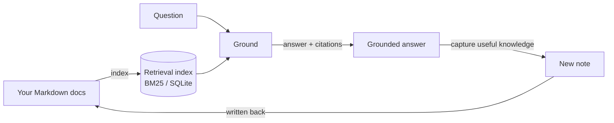

# Grounded Knowledge Engine

**An engine that grounds an AI agent's answers in your own Markdown and captures
what you learn back into the knowledge base — so the next answer is faster,
grounded, and consistent across whichever agent you use.** Stack: **Node ·
TypeScript · MCP**. Live demo: _coming soon_.

Think of it as a persistent, multi-project, agent-native NotebookLM: you keep a
folder of docs, an agent grounds its answers in them and writes useful new notes
back, and every agent (CLI, or any MCP client) queries the same knowledge base.

> **Status:** engine + MCP slice is the focus and runs end-to-end on the demo KB.
> The optional cockpit UI and the hosted demo are planned, not yet in this repo.

## The loop (the part that matters)

The engine exposes one capability — *grounded retrieve + capture* — and proves the
full **ingest → ground → answer → capture → re-answer** loop:



1. **Index** your docs (no error, demo corpus or your own).
2. **Answer** a question with citations *into* those docs.
3. **Capture** a new note from that interaction.
4. **Re-answer** a second question *from the captured note* — proving retain & reuse.
5. The same capability is exposed over **MCP** to any agent (smoke-tested).

## Run locally

Requires **Node ≥ 22.5** (for the built-in `node:sqlite`; Node 24 recommended).

```bash
npm install

# 2 + 3: grounded answer with citations (BM25 backend)
npm run search -- --query "are MCP tools model controlled or application controlled" \
  --mode generic --limit 5 --context 1 --refresh

# 1–4: the full grounding loop over MCP (answer → capture → re-answer)
npm run smoke:mcp

# retrieval quality against the demo eval set
npm run eval -- --refresh
```

Every claim above is enforced in CI (`.github/workflows/ci.yml`): `typecheck`,
`build`, `eval`, `smoke:mcp`, and a sanitization gate (`scrub`).

## Layers

| Layer | Role | Portability |
|---|---|---|
| **CLI** (`tools/grounding`) | Deterministic index / retrieve / evaluate. Scriptable, CI-able, no agent. | Universal |
| **MCP server** (`tools/kb-mcp-server`) | The same capability exposed to any agent over a standard protocol. | Any MCP client |
| **Skill** | Policy/playbook (local-first routing, capture discipline). | Deferred to a later release |

## Ingestion scope

- **Supported now (v0.1):** Markdown and plain pre-extracted text.
- **Planned adapters:** PDF and Word ingestion (an extraction step that emits
  Markdown/text the engine already handles).

## What this is / is not

- It **is** a local-first grounding engine: your docs stay on your machine, the
  index is derived data, and the MCP server runs locally.
- It is **not** a hosted SaaS or a production knowledge platform.

## Demo knowledge base

`demo-kb/` holds the runnable demo: paraphrased notes from the MIT-licensed
[Model Context Protocol docs](https://github.com/modelcontextprotocol/docs) plus a
thin original orchestration shell (a project board and open-questions log). Sources
and attribution are documented in [`docs/demo-sources.md`](docs/demo-sources.md).

## License

[MIT](LICENSE).
