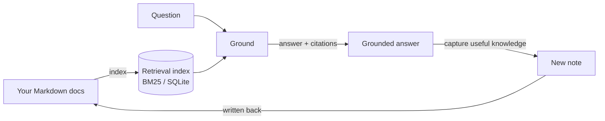

# Grounded Knowledge Engine

**An engine that grounds an AI agent's answers in your own Markdown and captures
what you learn back into the knowledge base — so the next answer is faster,
grounded, and consistent across whichever agent you use.** Stack: **Node ·
TypeScript · MCP**. Live demo: _coming soon_.

Think of it as a persistent, multi-project, agent-native NotebookLM: you keep a
folder of docs, an agent grounds its answers in them and writes useful new notes
back, and every agent (CLI, or any MCP client) queries the same knowledge base.

> **Status:** the engine + MCP slice is the focus and runs end-to-end on the demo KB.
> The optional cockpit UI now lives in [`apps/cockpit`](apps/cockpit) (typechecked,
> tested, and built in CI); only the hosted live demo is still planned.

## The loop (the part that matters)

<!-- Hero: static terminal render of the real loop (regenerate via scripts/record-loop.sh). -->


The engine exposes one capability — *grounded retrieve + capture* — and proves the
full **ingest → ground → answer → capture → re-answer** loop:



1. **Index** your docs (no error, demo corpus or your own).
2. **Answer** a question with citations *into* those docs.
3. **Capture** a new note from that interaction.
4. **Re-answer** a second question *from the captured note* — proving retain & reuse.
5. The same capability is exposed over **MCP** to any agent (smoke-tested).

## Run locally

Requires **Node ≥ 22.5** (for the built-in `node:sqlite`; Node 24 recommended).

```bash
npm install

# 2 + 3: grounded answer with citations (BM25 backend)
npm run search -- --query "are MCP tools model controlled or application controlled" \
  --mode generic --limit 5 --context 1 --refresh

# 1–4: the full grounding loop over MCP (answer → capture → re-answer)
npm run smoke:mcp

# retrieval quality against the demo eval set
npm run eval -- --refresh
```

Every claim above is enforced in CI (`.github/workflows/ci.yml`): `typecheck`,
`build`, `eval`, `smoke:mcp`, `test:loop`, the ingestion tests
(`test:ingest:unit`, `test:ingest`), the cockpit tests, and a sanitization gate
(`scrub`).

## Connect Claude Code, Codex, or Gemini CLI

There is one provider-neutral `kb` MCP server. To register that same local server
with Claude Code, Codex, and Gemini CLI, run:

```bash
npm run setup:mcp
```

Generated clients use the intentionally small `core` profile:
`kb.search`, `kb.get_record`, and `kb.answer_and_capture`. Advanced
administration and compatibility aliases are available with:

```bash
npm run setup:mcp -- --profile full
```

It is idempotent and:

1. Installs dependencies if needed (so `tsx` is available).
2. Uses absolute `node`, `tsx`, and server paths so GUI clients do not depend on shell
   `PATH` resolution.
3. Writes each client's project-local adapter:
   - Claude Code: `.mcp.json` plus local approval.
   - Codex: `.codex/config.toml`.
   - Gemini CLI: `.gemini/settings.json`.
4. Points every adapter at the same `tools/kb-mcp-server/server.ts`.
5. Runs `smoke:mcp` once to confirm the shared stdio server works.

The MCP catalog is schema-budgeted in CI. Every advertised tool has a formal
output schema and safety annotations, while indexed records are also
addressable through `gke://` resources. MCP therefore stays a thin
interoperability layer over the deterministic CLI/core.

Restart the client from this repository after setup. To configure only one client:
`--client claude`, `--client codex`, or `--client gemini`. Other flags:
`--profile core|full`, `--no-writes` (read-only KB), and `--skip-smoke`. The old `npm run setup:claude`
command remains as a Claude-only compatibility alias.

> The server speaks newline-delimited JSON over stdio (the MCP transport standard). If
> you fork it, keep `sendMessage`/`parseMessages` newline-framed — LSP-style
> `Content-Length` framing makes Claude Code hang at "connecting".

## Layers

| Layer | Role | Portability |
|---|---|---|
| **CLI** (`tools/grounding`) | Deterministic index / retrieve / evaluate. Scriptable, CI-able, no agent. | Universal |
| **MCP server** (`tools/kb-mcp-server`) | The same capability exposed to any agent over a standard protocol. | Any MCP client |
| **Skill** | Policy/playbook (local-first routing, capture discipline). | Deferred to a later release |

See [`docs/architecture.md`](docs/architecture.md) for the layered diagram and design choices.

## Ingesting documents

The most valuable workflow is **document-first**: feed real documents in and let
them become durable, grounded context. Whatever the path, ingestion ends the
same way — content becomes Markdown notes the engine indexes, so grounding and
the cockpit graph pick it up unchanged. Full design:
[`docs/document-ingestion-plan.md`](docs/document-ingestion-plan.md).

**Via the CLI** (PDF / DOCX / XLSX / Markdown / text — fully local, no external API):

```bash
npm run ingest -- ./inbox                 # capture every supported doc in ./inbox
npm run ingest -- ./inbox --dry-run       # preview notes without writing
npm run ingest -- ./inbox --module general --no-scrub
```

Each document becomes a topic note with provenance and a deterministic,
source-derived path (distinct files never collide; re-ingesting is idempotent).
Secrets/API keys are scrubbed by default; scanned image-only PDFs are detected
and skipped (OCR is out of scope). See
[`tools/ingest/README.md`](tools/ingest/README.md) for the module-level guide.

**Via an agent** (Claude Code, Codex, Gemini CLI, or another MCP client with the
`kb` server connected): attach a document and ask the agent to capture it — see
the copy-paste prompt in [`docs/ingest-recipe.md`](docs/ingest-recipe.md).

Ingestion is verified end to end (`npm run test:ingest`): each format's content
is extracted, captured, and proven retrievable and cited.

## What this is / is not

- It **is** a local-first grounding engine: your docs stay on your machine, the
  index is derived data, and the MCP server runs locally.
- It is **not** a hosted SaaS or a production knowledge platform.

## Demo knowledge base

`demo-kb/` holds the runnable demo: paraphrased notes from the MIT-licensed
[Model Context Protocol docs](https://github.com/modelcontextprotocol/docs) plus a
thin original orchestration shell (a project board and open-questions log). Sources
and attribution are documented in [`docs/demo-sources.md`](docs/demo-sources.md).

## License

[MIT](LICENSE).
