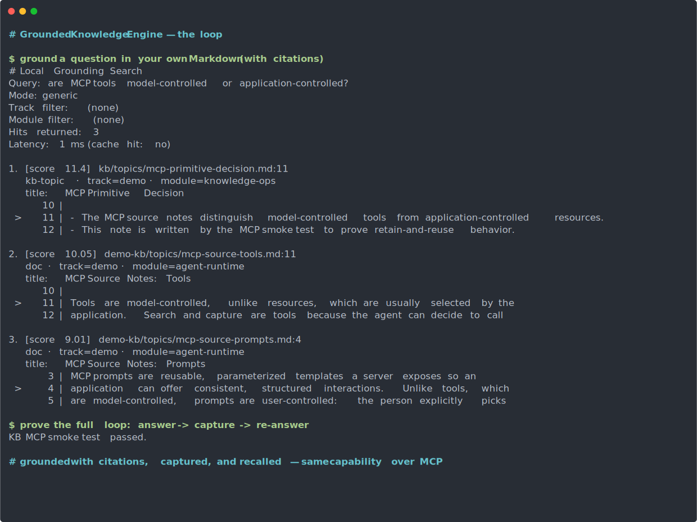
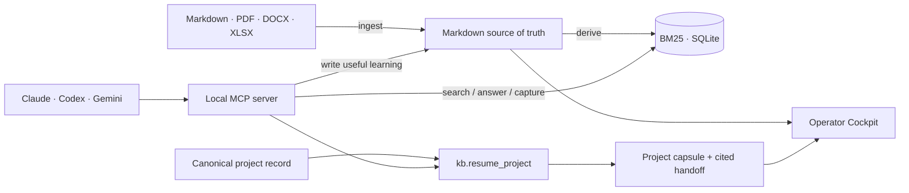

# Grounded Knowledge Engine

**Local-first, provider-neutral project memory for AI agents.**

Grounded Knowledge Engine (GKE) turns Markdown and real documents into a
searchable knowledge base, answers from that evidence with citations, captures
useful learning back into plain files, and resumes structured project context
across Claude Code, Codex, Gemini CLI, and other MCP clients.

Your files remain the source of truth. The retrieval index is disposable, the
MCP server runs locally, and the optional Operator Cockpit previews the same
project state that agents consume. The public Cockpit preview is planned for
[`gke.dimouzunov.com`](https://gke.dimouzunov.com) with the sanitized demo
workspace only.

> **Status:** grounded retrieval, capture, document ingestion, the provider-neutral
> MCP server, Project Context, and the React Cockpit are implemented and tested.
> GKE is not a hosted SaaS; the hosted Cockpit is a static public preview over
> demo content, not a hosted knowledge engine.

## What is implemented

| Capability                   | Current behavior                                                                                                                                                                   |
| ---------------------------- | ---------------------------------------------------------------------------------------------------------------------------------------------------------------------------------- |
| **Grounded retrieval**       | BM25 or SQLite FTS5 search over local Markdown, with file-and-line citations.                                                                                                      |
| **Durable capture**          | Useful answers become Markdown notes; unresolved questions can be recorded instead of guessed.                                                                                     |
| **Document ingestion**       | PDF, DOCX, XLSX, Markdown, and text are extracted locally, scrubbed, normalized, captured, and indexed.                                                                            |
| **Project resume**           | `kb.resume_project` returns current focus, recent changes, decisions, blockers/questions, next three actions, key documents, and citations.                                        |
| **One MCP server**           | Claude Code, Codex, and Gemini CLI use the same local `kb` server and knowledge base.                                                                                              |
| **Operator Cockpit**         | A React preview provides the knowledge library, project board, structured project detail, handoff copying, and context graph. The public preview uses sanitized demo content only. |
| **Bounded protocol surface** | The default MCP profile contains four semantic tools with output schemas, safety annotations, and CI-enforced schema budgets.                                                      |

## The compounding loop

<!-- Static render of real commands; regenerate via scripts/record-loop.sh. -->





The repository proves both loops end to end:

1. Ingest or index local content.
2. Answer from retrieved evidence with citations.
3. Capture useful learning back into Markdown.
4. Re-answer from the captured note in a fresh query.
5. Resume an explicitly identified project without mixing similarly named
   context from another project.
6. Render the same project facts in the local Cockpit and copy a technical
   handoff.



## Quick start

Requires **Node ≥ 22.5** for the built-in `node:sqlite`; Node 24 is recommended.

```bash
npm install

# Search the demo knowledge base
npm run search -- --query "are MCP tools model controlled or application controlled" \
  --mode generic --limit 5 --context 1 --refresh

# Prove MCP discovery, resources, grounding, capture, reuse, and project resume
npm run smoke:mcp

# Run the complete engine suite
npm run test:gke
```

The demo corpus lives in [`demo-kb`](demo-kb). The canonical Project Context
example is [`demo-kb/projects/router-rollout/project.md`](demo-kb/projects/router-rollout/project.md),
with explicitly linked evidence under
[`demo-kb/sources/router-rollout`](demo-kb/sources/router-rollout).

## Connect Claude Code, Codex, or Gemini CLI

Register the same local `kb` MCP server with all three clients:

```bash
npm run setup:mcp
```

The generated adapters use absolute executable and server paths and point to
[`tools/kb-mcp-server/server.ts`](tools/kb-mcp-server/server.ts):

- Claude Code: `.mcp.json` plus local approval.
- Codex: `.codex/config.toml`.
- Gemini CLI: `.gemini/settings.json`.

Configure one client or change the catalog policy:

```bash
npm run setup:mcp -- --client codex
npm run setup:mcp -- --profile full
npm run setup:mcp -- --no-writes
npm run setup:mcp -- --skip-smoke
```

The command is idempotent. Generated machine-specific configuration is ignored
by Git. Restart the configured client from this repository after setup.

### Default MCP surface

The intentionally small `core` profile exposes:

- `kb.search` — ranked local evidence with citations.
- `kb.get_record` — one indexed record by path, title, slug, or filename.
- `kb.answer_and_capture` — grounded answer plus capture policy.
- `kb.resume_project` — one compact, cited project capsule.

The `full` profile adds advanced retrieval, refresh, explicit write tools, and
compatibility aliases. Write tools are omitted from discovery unless writes are
enabled.

MCP resources expose addressable context without inflating the tool list:

- `gke://workspace/info`
- `gke://record/{path}`
- `gke://project/{projectId}/context`

Every advertised tool has a formal output schema and MCP safety annotations.
Catalog character and tool-count budgets are enforced by
`npm run test:mcp:catalog`.

### Thin agent skill

The provider-neutral
[`grounded-knowledge-workflow`](skills/grounded-knowledge-workflow/SKILL.md)
skill teaches an agent when to search local evidence, resume a project, retain
durable knowledge, or use the deterministic project CLI. It contains policy
only; all retrieval, citations, scoping, and writes remain in the shared engine.

Agents that support the Agent Skills layout can load the folder directly. For a
personal Codex installation, copy it into the local skill directory:

```bash
cp -R skills/grounded-knowledge-workflow ~/.codex/skills/
```

> The local server emits newline-delimited JSON over standard input/output. It
> is not a remote HTTP service. The transport also accepts legacy
> `Content-Length` input frames for compatibility, but generated client
> adapters use newline-delimited JSON.

## Structured project context

Canonical projects use one explicit record:

```text
kb/
├── projects/
│   └── router-rollout/
│       └── project.md
└── sources/
    └── router-rollout/
        └── evidence.md
```

`project.md` identifies the project with `record_type: project` and
`project_id`. Project membership is explicit through `project_id`,
`source_roots`, the canonical project folder, or linked documents. Semantic
similarity alone never makes a document part of a project.

`kb.resume_project` resolves only the requested ID and abstains for unknown
projects. Its output includes:

- a start-here brief;
- current focus and last meaningful change;
- active decisions;
- blockers and open questions;
- up to the next three actions (none for completed projects);
- key documents and line citations.

The shared parser and handoff formatter live under
[`tools/projects`](tools/projects). The Cockpit consumes the same model rather
than maintaining a separate interpretation of project Markdown. Legacy project
notes remain readable for compatibility.

**Implemented today:** canonical project records, the shared parser/normalizer,
project-scoped `kb.resume_project`, Cockpit rendering, and the `gke project` CLI
(`create`, `list`, `show`, `validate`, `update`, `link`).

**Planned (target architecture, not yet implemented):** automatic or CLI
checkpoint creation, multi-workspace vaults, decision-replay records, and the
remote MCP gateway. These appear in
[`docs/workspace-data-architecture.md`](docs/workspace-data-architecture.md) as
the normative target model; each record type there carries its own
**Implementation status** label so the current surface is never confused with
the planned one.

### Create and validate projects

Projects can be authored directly as Markdown or through the deterministic
project CLI. MCP is not required for project administration.

```bash
# Create the canonical record and default source folder
npm run project -- create customer-pilot \
  --title "Customer Pilot" \
  --owner "workspace-owner" \
  --track "product" \
  --status active \
  --tag pilot \
  --tag customer

# Inspect and validate projects
npm run project -- list
npm run project -- show customer-pilot
npm run project -- validate customer-pilot
npm run project -- validate             # validate every project

# Update known fields or sections without replacing the whole Markdown file
npm run project -- update customer-pilot \
  --current-focus "Validate the pilot workflow" \
  --next-action "Run the acceptance test" \
  --next-action "Record the result"

# Add an existing workspace file to Key documents and project scope
npm run project -- link customer-pilot notes/pilot-evidence.md \
  --label "Pilot evidence"

# Preview generated Markdown without writing
npm run project -- create another-pilot --title "Another Pilot" --dry-run
npm run project -- update customer-pilot --owner "new-owner" --dry-run
```

After `npm run build`, expose the compiled CLI as `gke` with `npm link`:

```bash
npm link
gke create customer-pilot --title "Customer Pilot"
```

The reusable TypeScript service exports `createProject`, `getProject`,
`listProjects`, `updateProject`, `linkProjectSource`, `validateProject`, and
`validateAllProjects` from
[`tools/projects`](tools/projects). Creation uses workspace-relative paths and
atomic writes. Validation is read-only and checks canonical metadata, dates,
required sections, duplicate IDs, lifecycle values, source roots, and local
links. Controlled updates preserve unknown frontmatter and body sections.

Direct editing remains supported. A manually created canonical record under
`kb/projects/<project-id>/project.md` is discovered by the CLI, Cockpit, and
`kb.resume_project` in the same way as a generated record.

To recreate the repository's demo as a standalone, portable workspace through
the same CLI:

```bash
npm run export:demo-projects
npm run project -- validate --repo-root examples/demo-project-workspace
```

The generated [`examples/demo-project-workspace`](examples/demo-project-workspace)
uses `kb/projects`, `kb/sources`, and `kb/topics` without duplicating IDs in the
main workspace.

## Operator Cockpit

The public frontend preview will be available at
[`gke.dimouzunov.com`](https://gke.dimouzunov.com). It is a static Vercel build
of `apps/cockpit` over the repository's sanitized demo knowledge base; it does
not expose the local MCP server, indexes, write tools, or private workspace
files.

Run the local preview:

```bash
cd apps/cockpit
npm install
npm run dev
```

The Cockpit reads `demo-kb` and `kb`, maps both into one logical knowledge
namespace, and provides:

- Mission Control and quick search;
- a Markdown knowledge library;
- a project board;
- structured project detail with focus, changes, decisions, questions,
  blockers, actions, and linked resources;
- **Copy Handoff**, including a fallback for restricted browser shells;
- a context graph.

See [`apps/cockpit/README.md`](apps/cockpit/README.md) for routes and development
details.

## Ingest real documents

Feed a folder containing rich documents, Markdown, or text files. Install
Microsoft MarkItDown for broader conversion coverage:

```bash
python -m pip install 'markitdown[all]'

npm run ingest -- ./inbox
npm run ingest -- ./inbox --dry-run
npm run ingest -- ./inbox --module general --no-scrub
```

The fully local pipeline is:

```text
detect → extract → normalize → scrub → capture → index
```

Supported formats: `.pdf`, `.docx`, `.xlsx`/`.xls`, `.pptx`, `.html`, `.csv`,
`.json`, `.xml`, `.zip`, `.epub`, `.md`, `.txt`. In the default
`GKE_INGEST_CONVERTER=auto` mode, rich files use the local MarkItDown CLI when
available; PDF/DOCX/XLSX fall back to native Node extractors. Use
`GKE_INGEST_CONVERTER=native` for the old native-only path or
`GKE_INGEST_CONVERTER=markitdown` to require MarkItDown.

Each source receives a deterministic path, making re-ingestion idempotent and
preventing same-named files from colliding. Secret-like values are scrubbed by
default. Image-only PDFs are detected and skipped in native mode because OCR is
outside the current scope.

Agents can also capture an attached document through the connected MCP server;
see [`docs/ingest-recipe.md`](docs/ingest-recipe.md). Developer details live in
[`tools/ingest/README.md`](tools/ingest/README.md).

## Architecture

| Layer                                        | Responsibility                                                                                                           |
| -------------------------------------------- | ------------------------------------------------------------------------------------------------------------------------ |
| [`tools/grounding`](tools/grounding)         | Deterministic indexing, retrieval, grounded synthesis, and evaluation.                                                   |
| [`tools/projects`](tools/projects)           | Canonical project parsing, strict scope resolution, resume capsules, citations, and handoff formatting.                  |
| [`tools/kb-mcp-server`](tools/kb-mcp-server) | Provider-neutral stdio transport, MCP catalog, handlers, resources, profiles, and safety contracts.                      |
| [`tools/ingest`](tools/ingest)               | Local document extraction and capture adapters.                                                                          |
| [`apps/cockpit`](apps/cockpit)               | Optional React preview over the same Markdown and shared project model; hosted as a static demo at `gke.dimouzunov.com`. |
| `demo-kb/` and `kb/`                         | Canonical plain-file knowledge and project state.                                                                        |

See [`docs/architecture.md`](docs/architecture.md) for the engine diagram and
[`docs/workspace-data-architecture.md`](docs/workspace-data-architecture.md) for
the wider project/workspace data model and planned consultant features.

## Verification

```bash
# Engine
npm run typecheck
npm run build
npm run test:gke
npm run scrub

# Cockpit
cd apps/cockpit
npm run typecheck
npm run test
npm run build
```

CI verifies type safety, builds, retrieval quality, MCP setup and contracts,
Project Context isolation, the capture/reuse loop, binary document ingestion,
the Cockpit, and secret/filename sanitization.

## Boundaries

- GKE is local-first: files and the MCP process stay on your machine.
- The public frontend preview is static and demo-only; it does not host user
  workspaces or the MCP process.
- The Markdown files are canonical; indexes and preview content are derived.
- The project scope is explicit and deterministic.
- GKE is not a hosted SaaS, Jira replacement, or general document-management
  platform.
- A temporary remote gateway for enterprise agents is a planned, opt-in
  integration—not part of the current core.

## Demo sources and license

The demo knowledge base contains paraphrased notes from the MIT-licensed
[Model Context Protocol documentation](https://github.com/modelcontextprotocol/docs)
plus original synthetic project records used to test isolation and handoff
behavior. Attribution is documented in
[`docs/demo-sources.md`](docs/demo-sources.md).

[MIT](LICENSE)
