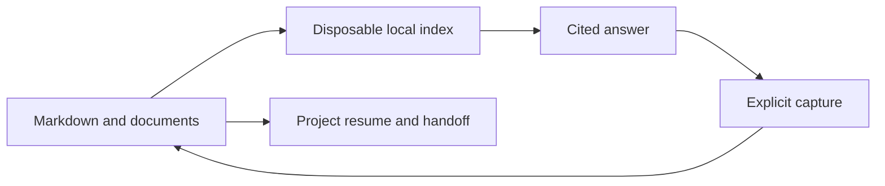

# Grounded Knowledge Engine

[](https://github.com/dimosgit/grounded-knowledge-engine/actions/workflows/ci.yml)
[](LICENSE)

**Local-first, provider-neutral project memory for AI coding agents.**

Grounded Knowledge Engine (GKE) gives Claude Code, Codex, Gemini CLI, and other
MCP clients durable context across sessions. It retrieves evidence from local
files, answers with file-and-line citations, captures useful learning when you
request it, and resumes structured project state without turning a database or
hosted service into the source of truth.

Your Markdown remains canonical. Retrieval indexes are derived and disposable,
and every workspace stays on your machine.

https://github.com/user-attachments/assets/70c7ed73-d70d-49b3-a077-b641ad3dc284

## What GKE does

- **Grounded answers:** BM25 or SQLite FTS5 retrieval with resolvable
  file-and-line citations, confidence signals, and strict abstention.
- **Durable capture:** clear new knowledge can be written immediately;
  duplicates, ambiguous routing, and consequential changes enter a guarded
  review queue.
- **Project continuity:** cited resume capsules combine current focus, recent
  changes, decisions, blockers, open questions, next actions, and checkpoints.
- **Document ingestion:** PDF, DOCX, XLSX, PPTX, HTML, Markdown, text, and other
  supported formats become traceable local source records.
- **One local MCP server:** the same engine works with Claude Code, Codex,
  Gemini CLI, GitHub Copilot, and other MCP-compatible clients.

GKE is for long-running work where decisions, constraints, evidence, and
handoffs must survive a fresh agent session. It is not a hosted chat-memory
service, team wiki, Jira replacement, or general document-management platform.

## Quick start

GKE requires **Node.js 22.5 or newer**; Node.js 24 is recommended.

Install the current release:

```bash
npm install --global https://github.com/dimosgit/grounded-knowledge-engine/releases/download/v0.2.1/grounded-knowledge-engine-0.2.1.tgz
```

Create the verified demo workspace and configure supported clients:

```bash
gke demo
cd gke-demo
gke setup
```

Restart Claude Code or Codex from `gke-demo`, then ask:

```text
Use GKE to resume the router-rollout project.
```

Continue with the
[five-minute golden path](docs/tutorials/five-minute-golden-path.md) to retrieve
cited evidence, retain one learning, and retrieve it again from a fresh
session.

## The core loop


```mermaid
flowchart LR
    D[Markdown and documents] --> I[Disposable local index]
    I --> A[Cited answer]
    A --> C[Explicit capture]
    C --> D
    D --> R[Project resume and handoff]
```

1. Index or ingest local evidence.
2. Answer from that evidence with citations.
3. Capture useful learning back into inspectable Markdown.
4. Retrieve it in a later session or resume the project as a cited briefing.

## MCP surface

The default `core` profile deliberately exposes four semantic tools:

- `kb.search` — return ranked local evidence.
- `kb.get_record` — retrieve one explicitly requested record.
- `kb.answer_and_capture` — answer with evidence and apply the selected capture
  policy.
- `kb.resume_project` — resume one explicitly identified project.

Automatic retention is read-only. Canonical writes require an explicit capture
strategy, a writable workspace, and the capture safety checks. The `full`
profile adds advanced retrieval, refresh, decision operations, and explicit
write tools without changing the Markdown source of truth.

See the [MCP server reference](tools/kb-mcp-server/README.md) for profiles,
resources, environment variables, and client setup.

## Bring your own workspace

Run `gke setup` inside the workspace you want to connect. Named workspace
vaults launch as separate processes with fixed roots; GKE does not perform
cross-workspace retrieval or silently switch between clients.

```bash
gke setup --workspace client-alpha --workspace-root "/path/to/client-alpha"
gke setup --workspace client-alpha --client codex
```

Named vaults default to writes disabled. See
[workspace configuration](docs/workspace-config.md) for scan roots, write
policy, domain vocabulary, and client-specific setup.

## Ingest documents

From a source checkout:

```bash
npm run ingest -- ./inbox
npm run ingest -- ./inbox --dry-run
npm run ingest -- ./inbox --project my-project
```

The local pipeline is:

```text
detect -> extract -> normalize -> scrub -> capture -> index
```

Sources receive stable workspace-local identities. Unchanged files are skipped;
changed or removed content enters the normal review flow before accepted source
state advances. Read the [ingestion guide](tools/ingest/README.md) for supported
formats, converter options, and provenance behavior.

## Optional Operator Cockpit

The Cockpit is a local, optional view over the same Markdown and shared engine
models. It provides project attention, capture review, decision review, and a
context graph. The hosted site is a static preview over sanitized demo data; it
does not host private workspaces or the MCP process.

See the [Cockpit guide](apps/cockpit/README.md) or open the
[public demo](https://gke.dimouzunov.com).

## Documentation

- [Five-minute golden path](docs/tutorials/five-minute-golden-path.md)
- [Architecture](docs/architecture.md)
- [Workspace configuration](docs/workspace-config.md)
- [Workspace and project data model](docs/workspace-data-architecture.md)
- [MCP server reference](tools/kb-mcp-server/README.md)
- [Document ingestion reference](tools/ingest/README.md)
- [GitHub Copilot integration](docs/integrations/github-copilot.md)

## Development

The engine and Cockpit use separate npm trees. Node.js 22 and 24 are tested in
CI.

```bash
npm install
npm run typecheck
npm run lint
npm run build
npm run test:gke
```

For the Cockpit:

```bash
cd apps/cockpit
npm install
npm run typecheck
npm run test
npm run build
```

Do not run the Cockpit test and build commands in parallel because both sync
Markdown into the preview content directory.

## Boundaries

- Markdown files are canonical; indexes and preview content are derived.
- The MCP server and private workspace files remain local.
- Project membership is explicit and deterministic, never inferred from
  semantic similarity.
- Writes are disabled by default for named vaults and remain subject to
  workspace policy, dry-run support, and conflict guards.
- The repository is public. Demo and example content must remain sanitized.

## License and demo sources

GKE is available under the [MIT License](LICENSE). The sanitized demo knowledge
base includes original synthetic project records and paraphrased notes from the
MIT-licensed Model Context Protocol documentation; see
[demo source attribution](docs/demo-sources.md).
