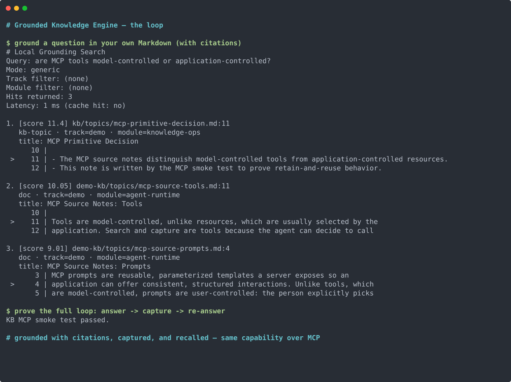
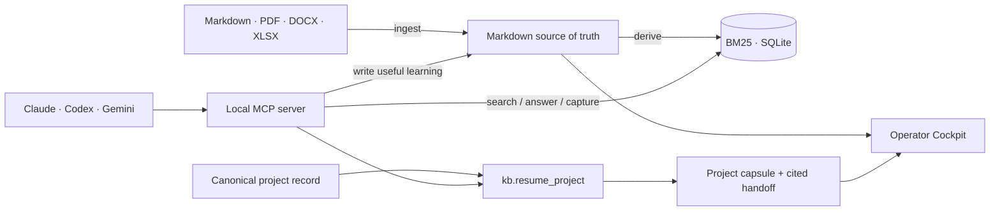

# Grounded Knowledge Engine

[](https://github.com/dimosgit/grounded-knowledge-engine/actions/workflows/ci.yml)
[](LICENSE)

**Local-first, provider-neutral project memory for AI agents.**

Grounded Knowledge Engine (GKE) turns Markdown and real documents into a
searchable knowledge base, answers from that evidence with citations, captures
useful learning back into plain files, and resumes structured project context
across Claude Code, Codex, Gemini CLI, and other MCP clients.

Your files remain the source of truth. The retrieval index is disposable, the
MCP server runs locally, and the optional Operator Cockpit previews the same
project state that agents consume. The public Cockpit preview is live at
[`gke.dimouzunov.com`](https://gke.dimouzunov.com) with the sanitized demo
workspace only.

> **Status:** grounded retrieval, capture, document ingestion, the provider-neutral
> MCP server, Project Context, and the React Cockpit are implemented and tested.
> GKE is not a hosted SaaS; the hosted Cockpit is a static public preview over
> demo content, not a hosted knowledge engine.

## What is implemented

| Capability                   | Current behavior                                                                                                                                                                                                                                                                                                    |
| ---------------------------- | ------------------------------------------------------------------------------------------------------------------------------------------------------------------------------------------------------------------------------------------------------------------------------------------------------------------- |
| **Grounded retrieval**       | BM25 or SQLite FTS5 search over local Markdown, with file-and-line citations.                                                                                                                                                                                                                                       |
| **Durable capture**          | Clear learning is captured immediately; ambiguous routing, duplicates, and destructive replacements enter a conflict-safe local review queue.                                                                                                                                                                       |
| **Document ingestion**       | PDF, DOCX, XLSX, Markdown, and text are extracted locally, scrubbed, normalized, captured, and indexed.                                                                                                                                                                                                             |
| **Project resume**           | `kb.resume_project` and `gke project resume` return the same action-first, cited briefing: what to do next, what changed, completed work, blockers, decisions, questions, current focus, and supporting documents.                                                                                                  |
| **Project checkpoints**      | `gke checkpoint` creates append-only, project-scoped handoff records with validated workspace-relative evidence citations; the latest checkpoint takes precedence when choosing where the next session should start.                                                                                                |
| **Daily project review**     | `gke review` and `gke://workspace/review` return due reviews, attention reasons, and explicitly scoped project changes since an ISO date.                                                                                                                                                                           |
| **One MCP server**           | Claude Code, Codex, Gemini CLI, and GitHub Copilot use the same local `kb` server and knowledge base.                                                                                                                                                                                                               |
| **Operator Cockpit**         | The React Cockpit eagerly loads a bounded catalog, loads full Markdown on demand, and provides a filterable Attention Inbox across projects, captures, decisions, questions, and changed evidence. Local development also adds grounded Ask, capture review, decision review, and source-provenance project deltas. |
| **Bounded protocol surface** | The default MCP profile contains four semantic tools with output schemas, safety annotations, and CI-enforced schema budgets.                                                                                                                                                                                       |

## The compounding loop

<!-- Static render of real commands; regenerate via scripts/record-loop.sh. -->




```mermaid
flowchart LR
    F[Markdown · PDF · DOCX · XLSX] -->|ingest| K[Markdown source of truth]
    K -->|derive| I[(BM25 · SQLite)]
    A[Claude · Codex · Gemini] --> M[Local MCP server]
    M -->|search / answer / capture| I
    M -->|write useful learning| K
    P[Canonical project record] --> R[kb.resume_project]
    M --> R
    R --> C[Project capsule + cited handoff]
    K --> O[Operator Cockpit]
    C --> O
```

The repository proves both loops end to end:

1. Ingest or index local content.
2. Answer from retrieved evidence with citations.
3. Capture useful learning back into Markdown.
4. Re-answer from the captured note in a fresh query.
5. Resume an explicitly identified project without mixing similarly named
   context from another project.
6. Render the same project facts in the local Cockpit and copy a technical
   handoff.



## Quick start

Requires **Node ≥ 22.5** for the built-in `node:sqlite`; Node 24 is recommended.

```bash
npm install

# Search the demo knowledge base
npm run search -- --query "are MCP tools model controlled or application controlled" \
  --mode generic --limit 5 --context 1 --refresh

# Prove MCP discovery, resources, grounding, capture, reuse, and project resume
npm run smoke:mcp

# See what needs attention and what changed
npx tsx tools/cli.ts review --as-of 2026-07-13 --since 2026-07-01

# Run the complete engine suite
npm run test:gke
```

The demo corpus lives in [`demo-kb`](demo-kb). The canonical Project Context
example is [`demo-kb/projects/router-rollout/project.md`](demo-kb/projects/router-rollout/project.md),
with explicitly linked evidence under
[`demo-kb/sources/router-rollout`](demo-kb/sources/router-rollout).

## Connect Claude Code, Codex, Gemini CLI, or GitHub Copilot

Register the same local `kb` MCP server with all four clients:

```bash
npm run setup:mcp
```

The generated adapters use absolute executable and server paths and point to
[`tools/kb-mcp-server/server.ts`](tools/kb-mcp-server/server.ts):

- Claude Code: `.mcp.json` plus local approval.
- Codex: `.codex/config.toml`.
- Gemini CLI: `.gemini/settings.json`.
- GitHub Copilot: `.mcp.json` for Copilot CLI and `.vscode/mcp.json` for
  Copilot Chat in VS Code.

Configure one client or change the catalog policy:

```bash
npm run setup:mcp -- --client codex
npm run setup:mcp -- --client github-copilot
npm run setup:mcp -- --profile full
npm run setup:mcp -- --no-writes
npm run setup:mcp -- --skip-smoke
```

The command is idempotent. Generated machine-specific configuration is ignored
by Git. Restart the configured client from this repository after setup.
See the [GitHub Copilot setup guide](docs/integrations/github-copilot.md) for
host-specific verification and organization-policy notes.

Register separate workspace vaults with one isolated MCP entry per process:

```bash
# First registration also records the local root in .gke/workspaces.json
npm run setup:mcp -- --workspace client-alpha \
  --workspace-root "/path/to/client-alpha"

# Reconfigure a registered vault without repeating its path
npm run setup:mcp -- --workspace client-alpha --client codex
npm run setup:mcp -- --list-workspaces
```

This creates `kb-client-alpha` beside the existing `kb` entry. Registered
vaults default to writes disabled; use `--writes` only when that vault's own
`.gke/workspace.json` explicitly sets `readOnly: false`. Setup never adds an
in-process workspace switch or cross-workspace search.

### Default MCP surface

The intentionally small `core` profile exposes:

- `kb.search` — ranked local evidence with citations.
- `kb.get_record` — one indexed record by path, title, slug, or filename.
- `kb.answer_and_capture` — grounded answer plus capture policy.
- Grounded answer responses include a labeled visible-text token estimate for
  the request, evidence, and answer; it is not presented as provider billing.
- `kb.resume_project` — one compact, cited project capsule.

The `full` profile adds advanced retrieval, refresh, explicit write tools, and
compatibility aliases. Write tools are omitted from discovery unless writes are
enabled.

### Capture review queue

Capture planning is separated from canonical Markdown mutation:

- a clear new path can still be created immediately;
- fuzzy duplicate matches are advisory and never redirect the write target;
- existing-target append or replacement becomes a versioned proposal with a
  SHA-256 base-content guard;
- explicit track, module, project, and path context wins; otherwise agreed
  evidence metadata can route a capture, while conflicting evidence enters
  review instead of being guessed;
- pending proposals stay in ignored local operational state under
  `.gke/capture-proposals/` and are excluded from retrieval and preview/export
  paths.

Review proposals without expanding the four-tool core MCP catalog:

```bash
gke capture list
gke capture show <proposal-id>
gke capture apply <proposal-id> --action replace
gke capture reject <proposal-id>
```

`--dry-run` and `--json` are available on the review commands where relevant.
The legacy `append` input remains accepted by MCP adapters, but consequential
existing-target writes now enter review instead of mutating canonical content
immediately.

While the local Cockpit development server is running, **Ask** returns an
evidence-gated answer with confidence, citations, and source excerpts. Project
Detail scopes both grounding and capture to its verified active project;
elsewhere the scope is explicitly workspace-wide. An explicit **Capture
answer** action reruns grounding server-side, immediately writes a clear new
note, and sends only ambiguous or conflicting captures to **Capture review**.
New proposals update the shared queue badge immediately, and **Review now**
opens the exact proposal. The review drawer shows current/proposed Markdown,
routing evidence, duplicate candidates, explicit apply actions, and rejection.
These local adapters are development-only and are not included in the public
static preview.

Project checklist work has a direct command and does not need to masquerade as
a knowledge note:

```bash
gke task add <project-id> "Review the capture route" --size S --status todo
```

MCP resources expose addressable context without inflating the tool list:

- `gke://workspace/info`
- `gke://record/{path}`
- `gke://project/{projectId}/context`

Every advertised tool has a formal output schema and MCP safety annotations.
Catalog character and tool-count budgets are enforced by
`npm run test:mcp:catalog`.

### Thin agent skill

The provider-neutral
[`grounded-knowledge-workflow`](skills/grounded-knowledge-workflow/SKILL.md)
skill teaches an agent when to search local evidence, resume a project, retain
durable knowledge, or use the deterministic project CLI. It contains policy
only; all retrieval, citations, scoping, and writes remain in the shared engine.

Agents that support the Agent Skills layout can load the folder directly. For a
personal Codex installation, copy it into the local skill directory:

```bash
cp -R skills/grounded-knowledge-workflow ~/.codex/skills/
```

> The local server emits newline-delimited JSON over standard input/output. It
> is not a remote HTTP service. The transport also accepts legacy
> `Content-Length` input frames for compatibility, but generated client
> adapters use newline-delimited JSON.

## Structured project context

Canonical projects use one explicit record:

```text
kb/
├── projects/
│   └── router-rollout/
│       └── project.md
└── sources/
    └── router-rollout/
        └── evidence.md
```

`project.md` identifies the project with `record_type: project` and
`project_id`. Project membership is explicit through `project_id`,
`source_roots`, the canonical project folder, or linked documents. Semantic
similarity alone never makes a document part of a project.

`kb.resume_project` resolves only the requested ID and abstains for unknown
projects. Its output includes:

- one recommended next action, promoted from the latest checkpoint when one
  exists;
- current focus, last meaningful change, and work completed at that checkpoint;
- separately structured active decisions, blockers, and open questions;
- up to three ordered actions (none for completed projects);
- key documents and line citations.

The shared parser and handoff formatter live under
[`tools/projects`](tools/projects). The Cockpit consumes the same model rather
than maintaining a separate interpretation of project Markdown. Legacy project
notes remain readable for compatibility.

**Implemented today:** canonical project, checkpoint, and decision records;
shared project parsing; project-scoped `kb.resume_project`; Cockpit project
rendering and Decision Replay views with preview-before-apply local review;
separately named multi-vault MCP entries; the `gke project` CLI (`create`,
`checkpoint`, `list`, `show`, `validate`, `update`, `link`); and the local
decision CLI (`create`, `get`, `list`, `review`, `supersede`). The MCP full
profile exposes the same decision lifecycle through dedicated tools and
addressable resources.

**Planned (target architecture, not yet implemented):** live Microsoft agent
validation and its production OAuth/OIDC authorization boundary. These appear in
[`docs/workspace-data-architecture.md`](docs/workspace-data-architecture.md) as
the normative target model; each record type there carries its own
**Implementation status** label so the current surface is never confused with
the planned one.

### Create and validate projects

Projects can be authored directly as Markdown or through the deterministic
project CLI. MCP is not required for project administration.

```bash
# Create the canonical record and default source folder
npm run project -- create customer-pilot \
  --title "Customer Pilot" \
  --owner "workspace-owner" \
  --track "product" \
  --status active \
  --tag pilot \
  --tag customer

# Inspect and validate projects
npm run project -- list
npm run project -- show customer-pilot
npm run project -- resume customer-pilot
npm run project -- validate customer-pilot
npm run project -- validate             # validate every project

# Update known fields or sections without replacing the whole Markdown file
npm run project -- update customer-pilot \
  --current-focus "Validate the pilot workflow" \
  --next-action "Run the acceptance test" \
  --next-action "Record the result"

# Add an existing workspace file to Key documents and project scope
npm run project -- link customer-pilot notes/pilot-evidence.md \
  --label "Pilot evidence"

# Preserve an explicit, append-only handoff with validated project evidence
npm run project -- checkpoint customer-pilot \
  --title "Acceptance handoff" \
  --what-changed "The pilot workflow now passes" \
  --completed "Ran the acceptance suite" \
  --next-start "Review the result with the customer" \
  --evidence "notes/pilot-evidence.md:12"

# Preview generated Markdown without writing
npm run project -- create another-pilot --title "Another Pilot" --dry-run
npm run project -- update customer-pilot --owner "new-owner" --dry-run
```

After `npm run build`, expose the compiled CLI as `gke` with `npm link`:

```bash
npm link
gke create customer-pilot --title "Customer Pilot"
gke project resume customer-pilot
```

The workspace-pinned `ProjectApplicationService` composes project creation,
inspection, validation, updates, tasks, source links, checkpoints, review, and
resume from [`tools/projects`](tools/projects). The CLI, MCP resume/resources,
and local Cockpit project workflows use that shared boundary. Creation uses
workspace-relative paths and atomic or exclusive append-only writes. Checkpoint
citations must resolve to existing line numbers inside explicit project scope.
Validation is read-only and checks canonical metadata, dates, required
sections, duplicate IDs, lifecycle values, source roots, and local links.
Controlled updates preserve unknown frontmatter and body sections.

Direct editing remains supported. A manually created canonical record under
`kb/projects/<project-id>/project.md` is discovered by the CLI, Cockpit, and
`kb.resume_project` in the same way as a generated record.

### Record and inspect decisions

The first Decision Replay slice stores structured, cited decisions under
`kb/decisions/`. Creation is append-only, active decisions require evidence,
project decisions accept citations only from explicit project scope, and
`review_after` is always rendered as `current`, `due`, or `overdue`.
The CLI, full-profile MCP tools, resources, and local Cockpit review endpoint
share one workspace-pinned Decision Application Service.

```bash
npm run decisions -- create pilot-location \
  --project customer-pilot \
  --title "Select the pilot location" \
  --status active \
  --owner "workspace-owner" \
  --decided-at 2026-07-29 \
  --evidence-checked-at 2026-07-29 \
  --review-after 2026-08-29 \
  --confidence medium \
  --question "Which location should host the pilot?" \
  --recommendation "Use the Alpha location" \
  --rationale "The validated local evidence best supports Alpha" \
  --evidence "kb/sources/customer-pilot/location-evidence.md:12"

npm run decisions -- get pilot-location --as-of 2026-08-30
npm run decisions -- list --project customer-pilot --review-state overdue
npm run decisions -- review pilot-location \
  --reviewed-at 2026-08-30 \
  --review-after 2026-09-30 \
  --reviewer "workspace-owner" \
  --supported uncertain \
  --evidence "kb/sources/customer-pilot/location-evidence.md:12@unchanged" \
  --evidence "kb/sources/customer-pilot/new-evidence.md:8@weakened"
npm run decisions -- supersede pilot-location pilot-location-v2 \
  --superseded-at 2026-08-31 \
  --reason "New evidence changed the operating constraint"
```

The MCP `full` profile adds `kb.get_decision` and `kb.list_decisions`.
When `KB_MCP_ENABLE_WRITES=true`, it also advertises `kb.record_decision`,
`kb.review_decision`, and `kb.supersede_decision`; otherwise those mutation
tools are absent from discovery. Reads are also addressable without adding
more tools:

```text
gke://workspace/decisions
gke://decision/{decisionId}
```

Compact responses omit rendered Markdown bodies. Pass `responseFormat: full`
when the complete evidence and review history is required. Due and overdue
records carry an explicit warning in tool responses and resources.

The Cockpit adds `#/decisions` and `#/decision/<decision-id>` routes over the
same browser-safe parser. The ledger filters by freshness and lifecycle; replay
shows the original evidence beside classified review changes and keeps stale
warnings visible. The public demo compares Valencia, Málaga, and Lisbon.
Canonical review writes still go through the MCP full profile or local CLI.

Creation supports `--dry-run`; retrieval resolves exact decision ID, canonical
path, or title. Filtering supports project, status, review state, owner, and
tag. Reviews preserve the original evidence snapshot, append structured
history, and classify evidence as unchanged, strengthened, weakened,
contradicted, missing, or new. Supersession preserves both records and writes
bidirectional links.

To recreate the repository's demo as a standalone, portable workspace through
the same CLI:

```bash
npm run export:demo-projects
npm run project -- validate --repo-root examples/demo-project-workspace
```

The generated [`examples/demo-project-workspace`](examples/demo-project-workspace)
uses `kb/projects`, `kb/sources`, and `kb/topics` without duplicating IDs in the
main workspace.

## Operator Cockpit

The public frontend preview is live at
[`gke.dimouzunov.com`](https://gke.dimouzunov.com). It is a static Vercel build
of `apps/cockpit` over the repository's sanitized demo knowledge base; it does
not expose the local MCP server, indexes, write tools, or private workspace
files.

Run the local preview:

```bash
cd apps/cockpit
npm install
npm run dev
```

The local Cockpit reads `demo-kb` and `kb` and maps both into one logical
knowledge namespace. Production builds are restricted to the sanitized
`demo-kb` corpus. Content sync generates a deterministic catalog, and the
browser loads complete Markdown only when a document or project needs it.
Library search covers titles, paths, frontmatter, excerpts, headings, and the
first 2,200 body characters per document; this bounded prefix replaces
unbounded full-body substring search so startup size does not scale with the
complete corpus. The Cockpit provides:

- Mission Control and a filterable Attention Inbox;
- a workspace identity panel that names the active workspace, its stable ID,
  whether local writes are enabled, and any non-default sensitivity — served in
  local development by a read-only loopback adapter that projects exactly four
  safe fields and never returns repository, scan, or write roots; the public
  build states `Demo workspace · Read-only preview` from compile-time constants
  and never ships the endpoint;
- a typed `Cmd/Ctrl+K` command palette that reaches documents, projects,
  decisions, and primary views, and opens review surfaces without writing —
  it ranks bounded, grouped results from catalog metadata only, never loads
  Markdown bodies, and omits local-only review actions from the public build;
- a Markdown knowledge library;
- a project board;
- structured project detail with focus, changes, decisions, questions,
  blockers, actions, and linked resources;
- **Copy Handoff**, including a fallback for restricted browser shells;
- a context graph.

See [`apps/cockpit/README.md`](apps/cockpit/README.md) for routes and development
details.

## Ingest real documents

Feed a folder containing rich documents, Markdown, or text files. Install
Microsoft MarkItDown for broader conversion coverage:

```bash
python -m pip install 'markitdown[all]'

npm run ingest -- ./inbox
npm run ingest -- ./inbox --dry-run
npm run ingest -- ./inbox --module general --no-scrub
npm run ingest -- ./inbox --project             # also create a project from the notes
npm run ingest -- ./inbox --project my-project  # ...with an explicit project name
```

The fully local pipeline is:

```text
detect → extract → normalize → scrub → capture → index
```

Supported formats: `.pdf`, `.docx`, `.xlsx`/`.xls`, `.pptx`, `.html`, `.csv`,
`.json`, `.xml`, `.zip`, `.epub`, `.md`, `.txt`. In the default
`GKE_INGEST_CONVERTER=auto` mode, rich files use the local MarkItDown CLI when
available; PDF/DOCX/XLSX fall back to native Node extractors. Use
`GKE_INGEST_CONVERTER=native` for the old native-only path or
`GKE_INGEST_CONVERTER=markitdown` to require MarkItDown.

Each source receives a stable workspace-local ID and a canonical record under
`kb/sources/`. Raw-byte hashes and extraction settings make unchanged
re-ingestion skip conversion. Changed and removed chunks enter the normal
capture review queue, and the accepted source hash advances only after all
candidate proposals are resolved successfully. Secret-like values are scrubbed
by default. Image-only PDFs are detected and skipped in native mode because OCR
is outside the current scope.

Agents can also capture an attached document through the connected MCP server;
see [`docs/ingest-recipe.md`](docs/ingest-recipe.md). Developer details live in
[`tools/ingest/README.md`](tools/ingest/README.md).

## Architecture

| Layer                                        | Responsibility                                                                                                                     |
| -------------------------------------------- | ---------------------------------------------------------------------------------------------------------------------------------- |
| [`tools/grounding`](tools/grounding)         | Workspace-pinned application service for deterministic BM25/SQLite retrieval, grounded synthesis, scoped answers, and evaluation.  |
| [`tools/projects`](tools/projects)           | Canonical project parsing, strict scope resolution, resume capsules, citations, and handoff formatting.                            |
| [`tools/decisions`](tools/decisions)         | Canonical decision creation, retrieval, review diffs, append-only history, supersession, and review-state warnings.                |
| [`tools/questions`](tools/questions)         | Workspace-pinned application service for atomic, deduplicated, workspace-authorized open-question mutation.                        |
| [`tools/capture`](tools/capture)             | Workspace-pinned application service for planning, proposal review, conflict-safe apply/reject, grounded capture, and refresh.     |
| [`tools/kb-mcp-server`](tools/kb-mcp-server) | Provider-neutral stdio transport, MCP catalog, handlers, resources, profiles, and safety contracts.                                |
| [`tools/ingest`](tools/ingest)               | Local document extraction and capture adapters.                                                                                    |
| [`apps/cockpit`](apps/cockpit)               | Optional React preview over the same Markdown and shared project/decision models; hosted as a static demo at `gke.dimouzunov.com`. |
| `demo-kb/` and `kb/`                         | Sanitized public demo knowledge and gitignored private local project state, respectively.                                          |

See [`docs/architecture.md`](docs/architecture.md) for the engine diagram and
[`docs/workspace-data-architecture.md`](docs/workspace-data-architecture.md) for
the wider project/workspace data model and planned consultant features.

## Verification

```bash
# Engine
npm run typecheck
npm run build
npm run test:retrieval
npm run test:gke
npm run scrub

# Cockpit
cd apps/cockpit
npm run typecheck
npm run test
npm run build
```

CI verifies type safety, builds, and an isolated synthetic retrieval suite on
both BM25 and SQLite. The retrieval gate enforces aggregate and per-category
floors for exact and vague recall, overlapping project ranking, abstention,
freshness, multi-track filtering, and citation resolution. It never scans the
machine-local `kb/`. CI also verifies MCP setup and contracts, Project Context
isolation, the capture/reuse loop, binary document ingestion, the Cockpit, and
secret/filename sanitization.

## Boundaries

- GKE is local-first: files and the MCP process stay on your machine.
- The public frontend preview is static and demo-only; it does not host user
  workspaces or the MCP process.
- The Markdown files are canonical; indexes and preview content are derived.
- The project scope is explicit and deterministic.
- GKE is not a hosted SaaS, Jira replacement, or general document-management
  platform.
- The read-only loopback gateway exists as an opt-in proof; live enterprise
  agent/tunnel integration remains planned and is not part of the current core.

## Demo sources and license

The demo knowledge base contains paraphrased notes from the MIT-licensed
[Model Context Protocol documentation](https://github.com/modelcontextprotocol/docs)
plus original synthetic project and decision records used to test isolation,
handoff, and Decision Replay behavior. Attribution is documented in
[`docs/demo-sources.md`](docs/demo-sources.md).

[MIT](LICENSE)
