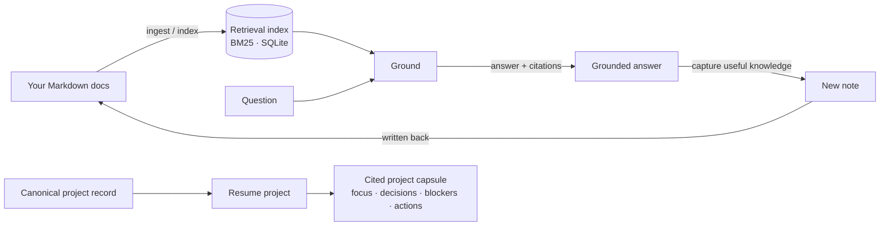
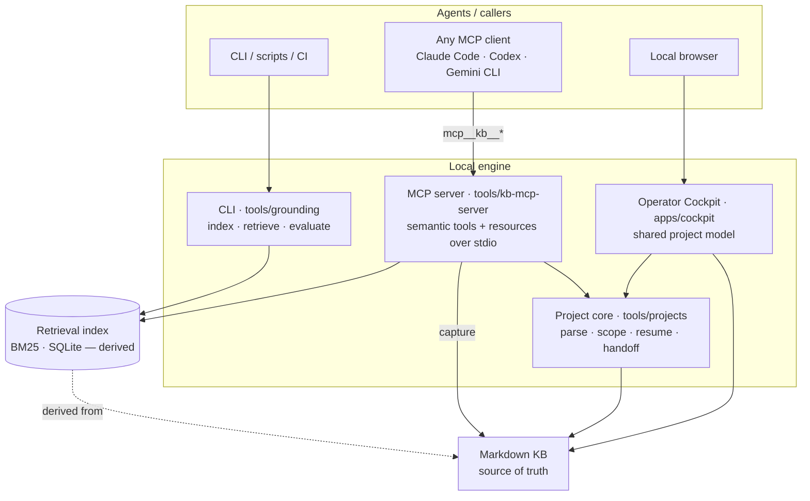

# Architecture

GKE has a deterministic local core for grounded retrieval, capture, document
ingestion, and structured project resume. The CLI, MCP server, and optional
Cockpit expose those capabilities over the same Markdown source of truth.

The checked-in SVG is generated from [`architecture.mmd`](architecture.mmd).

The current engine architecture is documented here. The normative target data
model for the planned consultant features—workspaces, projects, checkpoints,
decisions, sources, runtime policy, and migration—is defined in
[`workspace-data-architecture.md`](workspace-data-architecture.md).

## The loop

1. **Ingest / index** — your docs become a derived retrieval index (BM25 over SQLite).
   The index is regenerable; the docs are the source of truth.
2. **Ground** — a question is answered *into* your docs, with citations.
3. **Capture** — a useful new note is written back into the doc set.
4. **Re-answer** — a later question is served *from the captured note*, proving retain
   & reuse across sessions/agents.
5. **Resume** — an explicitly identified project produces a compact capsule
   without leaking similarly named context from another project.

## Layers

| Layer | Role | Portability |
|---|---|---|
| **CLI** (`tools/grounding`) | Deterministic index / retrieve / evaluate. Scriptable, CI-able, no agent. | Universal |
| **Project core** (`tools/projects`) | Canonical project parsing, strict membership, cited capsules, and handoff formatting. | CLI/MCP/browser-safe shared model |
| **MCP server** (`tools/kb-mcp-server`) | Four-tool core catalog plus logical resources over a standard local protocol. | Any MCP client |
| **Cockpit** (`apps/cockpit`) | Optional local browser preview over the same Markdown and project parser. | Local web UI |
| **Index** (BM25 · SQLite) | Derived retrieval data. Disposable — rebuilt from the docs. | Regenerable |
| **KB** (Markdown) | Your notes. The single source of truth. | Plain files |

## Design choices

- **Local-first.** Docs, index, and MCP server all run on your machine; nothing is hosted.
- **Derived data is disposable.** The SQLite index is a cache of the Markdown, never the
  other way around — delete it and `--refresh` rebuilds it.
- **Shared core, multiple surfaces.** CLI, MCP, and Cockpit reuse deterministic
  grounding/project modules so CI can prove what agents and the preview receive.
- **Explicit project boundaries.** `project_id`, canonical folders,
  `source_roots`, and links define membership; similarity never silently expands
  scope.
- **Small semantic MCP catalog.** Daily-use tools remain bounded, while addressable
  context uses `gke://` resources.
- **Newline-delimited JSON over stdio** is the emitted MCP transport format.
  The parser accepts legacy `Content-Length` input frames for compatibility,
  while generated adapters use newline-delimited JSON to avoid client
  connection hangs.
