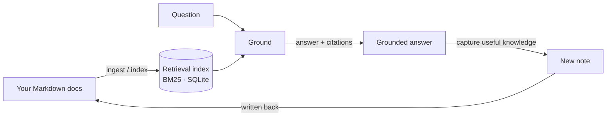
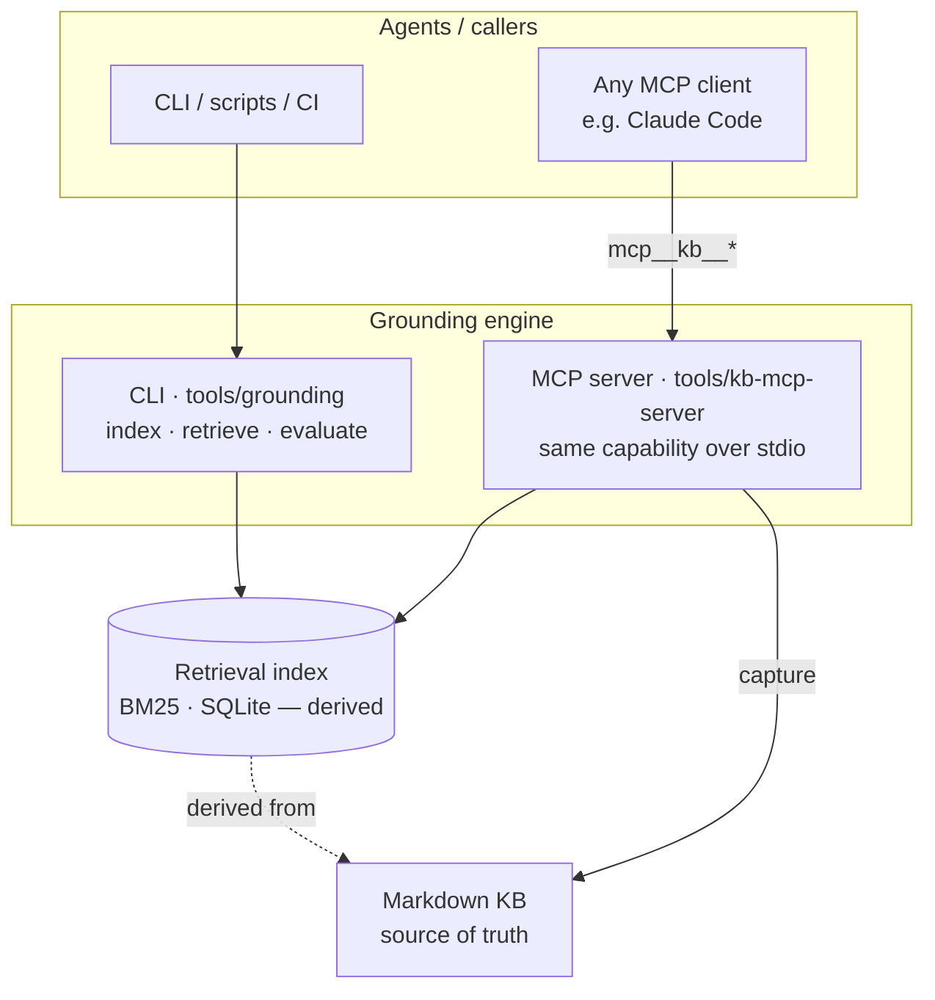

# Architecture

One capability — *grounded retrieve + capture* — exposed two ways (CLI and MCP) over a
single retrieval index derived from your Markdown.

## The loop

1. **Ingest / index** — your docs become a derived retrieval index (BM25 over SQLite).
   The index is regenerable; the docs are the source of truth.
2. **Ground** — a question is answered *into* your docs, with citations.
3. **Capture** — a useful new note is written back into the doc set.
4. **Re-answer** — a later question is served *from the captured note*, proving retain
   & reuse across sessions/agents.

## Layers

| Layer | Role | Portability |
|---|---|---|
| **CLI** (`tools/grounding`) | Deterministic index / retrieve / evaluate. Scriptable, CI-able, no agent. | Universal |
| **MCP server** (`tools/kb-mcp-server`) | The same capability exposed to any agent over a standard protocol. | Any MCP client |
| **Index** (BM25 · SQLite) | Derived retrieval data. Disposable — rebuilt from the docs. | Regenerable |
| **KB** (Markdown) | Your notes. The single source of truth. | Plain files |

## Design choices

- **Local-first.** Docs, index, and MCP server all run on your machine; nothing is hosted.
- **Derived data is disposable.** The SQLite index is a cache of the Markdown, never the
  other way around — delete it and `--refresh` rebuilds it.
- **One capability, two surfaces.** The CLI and the MCP server call the same grounding
  core, so CI can prove what an agent will get.
- **Newline-delimited JSON over stdio** for the MCP transport (not LSP `Content-Length`
  framing — that makes Claude Code hang at "connecting").
