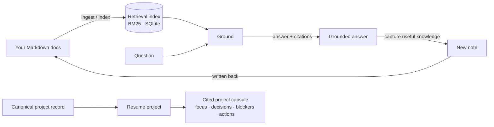
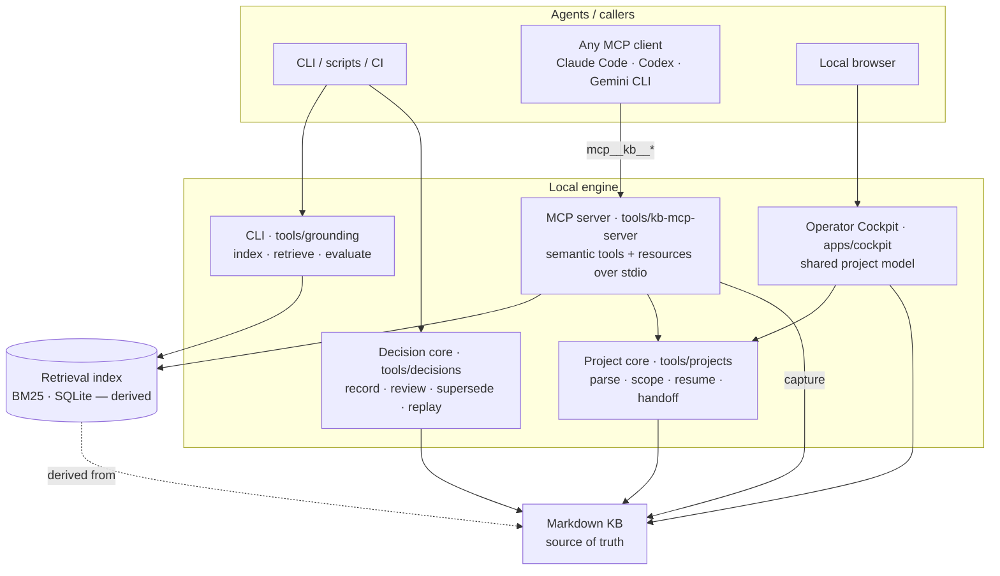

# Architecture

GKE has a deterministic local core for grounded retrieval, capture, document
ingestion, structured project resume, and canonical decision records. The CLI,
MCP server, and optional Cockpit expose the supported capabilities over the
same Markdown source of truth.

The checked-in SVG is generated from [`architecture.mmd`](architecture.mmd).

The current engine architecture is documented here. The normative target data
model for the consultant features—workspaces, projects, checkpoints,
decisions, sources, runtime policy, and migration—is defined in
[`workspace-data-architecture.md`](workspace-data-architecture.md).

## The loop

```mermaid
flowchart LR
    DOCS[Your Markdown docs] -->|ingest / index| IDX[(Retrieval index<br/>BM25 · SQLite)]
    Q[Question] --> GROUND[Ground]
    IDX --> GROUND
    GROUND -->|answer + citations| ANS[Grounded answer]
    ANS -->|capture useful knowledge| NOTE[New note]
    NOTE -->|written back| DOCS
    PROJECT[Canonical project record] --> RESUME[Resume project]
    RESUME --> CAPSULE[Cited project capsule<br/>focus · decisions · blockers · actions]
```

1. **Ingest / index** — your docs become a derived retrieval index (BM25 over SQLite).
   The index is regenerable; the docs are the source of truth.
2. **Ground** — a question is answered _into_ your docs, with citations.
3. **Capture** — a useful new note is written back into the doc set.
4. **Re-answer** — a later question is served _from the captured note_, proving retain
   & reuse across sessions/agents.
5. **Resume** — an explicitly identified project produces a compact capsule
   without leaking similarly named context from another project.

## Layers

```mermaid
flowchart TB
    subgraph clients[Agents / callers]
      CLI_USER[CLI / scripts / CI]
      AGENT[Any MCP client<br/>Claude Code · Codex · Gemini CLI]
      USER[Local browser]
    end

    subgraph engine[Local engine]
      CLI[CLI · tools/grounding<br/>index · retrieve · evaluate]
      PROJECTS[Project core · tools/projects<br/>parse · scope · resume · handoff]
      DECISIONS[Decision core · tools/decisions<br/>record · review · supersede · replay]
      MCP[MCP server · tools/kb-mcp-server<br/>semantic tools + resources over stdio]
      COCKPIT[Operator Cockpit · apps/cockpit<br/>shared project model]
    end

    IDX[(Retrieval index<br/>BM25 · SQLite — derived)]
    KB[Markdown KB<br/>source of truth]

    CLI_USER --> CLI
    CLI_USER --> DECISIONS
    AGENT -->|mcp__kb__*| MCP
    USER --> COCKPIT
    CLI --> IDX
    MCP --> IDX
    MCP --> PROJECTS
    COCKPIT --> PROJECTS
    IDX -.derived from.-> KB
    MCP -->|capture| KB
    PROJECTS --> KB
    DECISIONS --> KB
    COCKPIT --> KB
```

| Layer                                  | Role                                                                                                                                                                                           | Portability                          |
| -------------------------------------- | ---------------------------------------------------------------------------------------------------------------------------------------------------------------------------------------------- | ------------------------------------ |
| **Grounding core** (`tools/grounding`) | Workspace-pinned application service over deterministic BM25/SQLite indexing, search, scoped grounded answers, refresh, and evaluation.                                                        | Shared by CLI, MCP, and Cockpit      |
| **Project core** (`tools/projects`)    | Workspace-pinned application service over canonical project administration, checkpoints, strict membership, review, cited capsules, and handoff formatting.                                    | Shared by CLI, MCP, and Cockpit      |
| **Decision core** (`tools/decisions`)  | Workspace-pinned application service over canonical creation, exact retrieval, evidence review diffs, append-only history, supersession, and review-state calculation.                         | Shared by CLI, MCP, and Cockpit      |
| **Question core** (`tools/questions`)  | Workspace-pinned application service over atomic, exactly deduplicated, workspace-authorized open-question mutation.                                                                           | Shared provider-neutral core         |
| **Capture core** (`tools/capture`)     | Workspace-pinned application service over deterministic planning, proposal review, conflict-safe apply/reject, grounded capture, and post-mutation refresh.                                    | Shared by CLI, MCP, and Cockpit      |
| **MCP server** (`tools/kb-mcp-server`) | Four-tool core; the full profile adds decision operations and logical resources without expanding the daily-use catalog.                                                                       | Any MCP client                       |
| **Cockpit** (`apps/cockpit`)           | Optional browser UI over shared project and decision parsers, with loopback-only preview/apply workflows in local development. The public preview is a static demo build, not a hosted engine. | Local web UI / static public preview |
| **Index** (BM25 · SQLite)              | Derived retrieval data. Disposable — rebuilt from the docs.                                                                                                                                    | Regenerable                          |
| **KB** (Markdown)                      | Your notes. The single source of truth.                                                                                                                                                        | Plain files                          |

## Design choices

- **Local-first.** Docs, index, and MCP server all run on your machine. The
  hosted Cockpit preview is static demo content only, not a remote MCP service.
- **Derived data is disposable.** The SQLite index is a cache of the Markdown, never the
  other way around — delete it and `--refresh` rebuilds it.
- **Shared core, multiple surfaces.** CLI, MCP, and Cockpit reuse the
  workspace-pinned grounding, project, decision, open-question, and capture
  application services. CI proves each exposed surface against the same
  Markdown contracts.
- **Explicit project boundaries.** `project_id`, canonical folders,
  `source_roots`, and links define membership; similarity never silently expands
  scope.
- **Process-isolated workspace vaults.** `setup:mcp` can register local roots and
  generate one named client entry per vault. Each entry launches a process with
  one immutable workspace root; there is no in-process switch or cross-workspace
  search.
- **Small semantic MCP catalog.** Daily-use tools remain bounded, while addressable
  context uses `gke://` resources.
- **Decision Replay stays explicit.** The full profile exposes record, get,
  list, review, and supersede operations. Decision mutation tools disappear
  from discovery when writes are disabled; ledger and record reads remain
  addressable as `gke://workspace/decisions` and
  `gke://decision/{decisionId}`. Local Cockpit review requires a validated
  dry-run preview before apply, and its endpoint is absent from production
  bundles.
- **Newline-delimited JSON over stdio** is the emitted MCP transport format.
  The parser accepts legacy `Content-Length` input frames for compatibility,
  while generated adapters use newline-delimited JSON to avoid client
  connection hangs.
