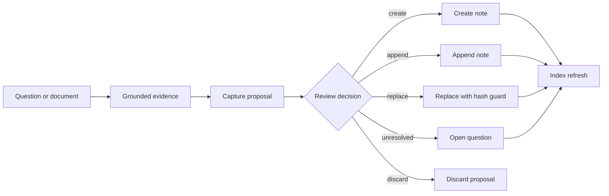

# Capture Integrity and Operator Workflow Roadmap

**Status:** In progress — capture P0, policy routing, project task capture,
daily attention in the engine/CLI/read-only MCP resource, source-aware
ingestion, shared atomic open-question mutation, and the local Cockpit
project-scoped Ask/live review workflow, and Cockpit daily attention are
implemented. Cockpit scaling remains planned. **Review date:** 2026-07-14. **Repository:** Grounded
Knowledge Engine. **Current execution:** [Current Hardening and Operator
Execution Plan](2026-07-14-current-hardening-and-operator-execution-plan.md).

## Product decision

Prioritize a safe capture-planning and review workflow before adding semantic
retrieval, more core MCP tools, or a hosted write service.

GKE already proves the retrieval loop: index local evidence, return citations,
capture durable knowledge, and retrieve it again. The next compounding
improvement is to make the transition from evidence to canonical knowledge
explicit, conflict-safe, reviewable, and reusable from every client.

## Current strengths to preserve

- Markdown remains canonical and indexes remain disposable.
- The default MCP profile stays at four semantic tools.
- Writes stay disabled by default and support dry-run behavior.
- Project membership is explicit rather than inferred from similarity.
- The public Cockpit remains a static, read-only preview over sanitized demo
  content.
- Mermaid strict mode, browser hardening, engine/Cockpit CI, and the read-only
  loopback HTTP bridge are already implemented. They are not backlog items in
  this roadmap.
- Workspace trust boundaries, sensitivity policy, and decision replay already
  have dedicated plans. This roadmap links to them rather than duplicating
  their scope.

## Why capture integrity comes first

Before P0, the upsert path used fuzzy title/body similarity to choose an
existing note path. A fuzzy candidate above the threshold could therefore
become the write target, and the normal non-append path replaced that file.
That coupled useful dedupe intent to a destructive mutation decision.

Capture also moves directly from answer to canonical Markdown. There is no
durable proposal state where a user can compare create, append, replace, open
question, and discard choices before committing the result.

The target model should separate three concerns:

1. **Plan** — determine evidence, target metadata, duplicate candidates, and
   proposed action without mutating canonical knowledge.
2. **Review** — expose the proposal and any diff through deterministic CLI/API
   output.
3. **Apply** — perform one explicit, conflict-checked canonical write and then
   refresh derived indexes.



## Roadmap

### P0 — Capture Planner and Review Queue

**Implementation status:** Implemented on 2026-07-13. The reusable capture
service lives under `tools/capture/`; the review CLI is available through `gke
capture`; MCP capture output reports pending proposal metadata without adding a
core tool; and regression coverage is part of `npm run test:gke`.

#### Outcome

No fuzzy similarity result can silently select a destructive write target.
Consequential captures become durable proposals that can be inspected and
applied deterministically.

#### Target behavior

- Exact requested paths and deterministic source identities are distinguished
  from fuzzy duplicate candidates.
- Fuzzy candidates are advisory only.
- Replacing existing content requires an explicit conflict policy and a
  matching base-content hash.
- Pending proposals live under `.gke/capture-proposals/` because they are
  operational state, not canonical knowledge.
- Proposal files are excluded from retrieval, Cockpit content sync, demo
  export, and public artifacts.
- Proposal review and apply are available through deterministic core/CLI code.
  The core MCP tool count does not increase.

#### First implementation prompt

- [Capture Planner and Review Queue](../prompt/2026-07-13-capture-planner-review-queue.md)

### P1 — Policy-Driven Track, Module, and Project Routing

**Implementation status:** Implemented on 2026-07-13. Capture proposals record
machine-readable routing decisions. Explicit context wins, caller-identified
projects are verified before supplying defaults, evidence is deduplicated by
path and must reach consensus, inferred project membership always requires
review, and conflicting evidence never silently selects a route.

#### Outcome

Captures land in the intended logical context without relying on a generic
fallback when stronger context exists.

#### Target behavior

1. Explicit `projectId`, `track`, `module`, and requested path win.
2. An active project may supply defaults only when the caller identifies it.
3. Retrieved evidence metadata may propose a route when sources agree.
4. Ambiguous routing produces a review-required proposal rather than a guessed
   canonical placement.
5. Workspace-specific taxonomy remains workspace data or policy; the public
   engine does not hard-code domain names.

#### Dependencies

- Depends on the Capture Planner proposal contract.
- Must remain compatible with the dedicated
  [Workspace Vaults and Leakage Guard](../prompt/2026-06-21-workspace-vaults-leakage-guard.md).

### P1 — Daily Attention and Project Delta

**Implementation status:** Engine, CLI, and read-only MCP resource implemented
on 2026-07-13. `gke review` computes due/overdue state, blocker and
open-question attention, and explicitly scoped document changes since an ISO
date. Change provenance prefers Git commit timestamps and falls back to
frontmatter or file modification time for dirty, ignored, or non-Git files.
`gke://workspace/review` exposes the current compact report without adding a
core MCP tool. The Cockpit now reuses browser-safe attention rules for Hub
summaries and Board filters; local development additionally exposes a bounded,
read-only changed-document view with source provenance.

#### Outcome

Project resume answers not only “what is the current state?” but also “what
needs attention now?” and “what changed since the requested point in time?”

#### Target behavior

- Compute due/overdue review state from `review_after` without treating an
  overdue project as invalid.
- Add an optional `since` value to project context at the application-service
  layer.
- Return changed explicitly scoped documents with citations.
- Provide a `gke review` CLI and/or `gke://workspace/review` resource instead of
  adding another core tool.
- Let the Cockpit filter due reviews, blockers, and open questions by project
  and status.
- Use Git history when available and documented frontmatter/file timestamps as
  the portable fallback.

#### Dependencies

- Reuse the shared project parser and explicit project-scope rules.
- Coordinate with [Decision Replay](../prompt/2026-06-21-decision-replay.md);
  do not implement the decision record type inside this feature.

### P1 — Retrieval Evaluation That Matches Real Workspaces

**Implementation status:** The isolated quality gate was implemented on
2026-07-13. A synthetic mini-workspace covers exact and vague recall,
overlapping projects, strict abstention, stale/current guidance, multi-track
filters, and multi-source citations. The evaluator reports aggregate and
per-category metrics, validates citation paths, keeps negative cases out of
positive-query MRR, and fails declared floors. `npm run test:retrieval` gates
both BM25 and SQLite without scanning demo or machine-local knowledge. Optional
local feedback metrics remain planned.

#### Outcome

Retrieval changes are judged across several knowledge shapes, not only the
small public demo corpus.

#### Target behavior

- Keep the current demo evaluation small and deterministic.
- Add reusable evaluation fixtures for:
  - exact terms and titles;
  - vague “I remember something like…” recall;
  - project isolation with overlapping vocabulary;
  - negative/abstention cases;
  - stale versus current records;
  - multi-track filtering;
  - citation coverage.
- Report per-category floors in addition to aggregate Recall@K and MRR.
- Add optional local-only feedback metrics without storing raw query text by
  default.
- Evaluate semantic fallback only if the expanded suite proves a lexical recall
  gap. Do not introduce embeddings as a speculative prerequisite.

### P1 — Source-Aware Ingestion and Re-ingestion Diffs

**Implementation status:** Implemented on 2026-07-14. Raw-byte and extraction
settings hashes short-circuit unchanged sources; canonical source records retain
accepted converter/version provenance; changed and removed chunks use the
capture review queue and candidate state under `.gke/`.

#### Outcome

Every ingested note can be traced to a source version, and changed source files
produce reviewable deltas rather than blind replacement.

#### Target behavior

- Record source hash, converter, converter version, ingestion timestamp, and
  optional project identity.
- Treat unchanged re-ingestion as idempotent.
- Route changed re-ingestion through the Capture Planner with a diff.
- Keep source artifacts and sensitivity decisions inside the active workspace
  boundary.
- Add OCR only as an optional adapter after changed-source review is safe.

### P2 — Local Cockpit Ask and Review Drawer

**Implementation status:** Implemented on 2026-07-13. The local Cockpit now
provides grounded Ask and capture-review drawers backed by provider-neutral
answer/capture services and development-only, loopback and same-origin
adapters. Capturing reruns grounding server-side; clear new notes are applied
immediately, while duplicates, route conflicts, and existing targets enter the
review queue. The production static build registers neither adapter.

#### Outcome

A local user can inspect evidence, review a capture proposal, and apply or
reject it without switching away from the Cockpit.

#### Target behavior

- Factor provider-neutral application services out of the MCP protocol adapter.
- Reuse those services from stdio, the authenticated loopback adapter, and the
  local Cockpit.
- Show evidence, gate result, citations, proposed route, duplicate candidates,
  and diff.
- Compile or configure the public static preview as read-only. It must not
  contain a write adapter or connect to a local workspace implicitly.
- Keep remote/tunnel transport read-only unless a separate reviewed feature
  explicitly changes that boundary.

### P2 — Cockpit Content Scaling

#### Outcome

Cockpit startup cost does not grow linearly with every complete Markdown body.

#### Target behavior

- Generate a compact catalog/search document during content sync.
- Eagerly load metadata and excerpts only.
- Lazy-load full Markdown bodies by logical path.
- Preserve offline static preview behavior and hash-route deep links.
- Add an initial-bundle budget to Cockpit CI.

This is a scaling improvement, not a current public-demo blocker. The demo
corpus is intentionally small.

### P2 — MCP Application-Service Extraction

#### Outcome

Protocol, grounding, capture policy, repository mutation, and project context
can evolve independently.

#### Suggested boundaries

- `SearchService`
- `GroundingService`
- `CapturePlanner`
- `CaptureRepository`
- `KnowledgeRepository`
- `ProjectContextService`
- stdio/HTTP/Cockpit adapters

Perform this extraction incrementally alongside Capture Planner work. Preserve
the current MCP schemas and transport behavior throughout the refactor.

## Delivery order

### Phase 1 — Protect canonical knowledge

1. Make fuzzy dedupe advisory-only.
2. Add content-hash conflict detection.
3. Introduce the capture proposal schema and local operational queue.
4. Add deterministic proposal list/show/apply/reject operations.
5. Prove existing canonical notes are preserved under fuzzy matches and stale
   proposal application.

### Phase 2 — Make review operational

1. Add policy-driven routing. **Implemented.**
2. Add due-review/project-delta output. **Engine, CLI, resource, and Cockpit
   attention implemented.**
3. Add source-aware ingestion deltas.
4. Expand retrieval evaluation categories.

### Phase 3 — Close the local product loop

1. Extract reusable application services. **Grounded answer and capture
   application boundaries implemented; broader extraction remains planned.**
2. Add the local Cockpit Ask/Review drawer. **Implemented.**
3. Split Cockpit metadata from lazily loaded bodies.

## Shared constraints

1. Markdown remains canonical.
2. `.gke/` remains local operational state and must never become searchable
   knowledge.
3. The core MCP profile remains at four tools unless a separate catalog review
   approves a change.
4. New semantic operations should prefer existing tools, resources, or the CLI
   over low-level file-management tools.
5. Existing stdio clients, the read-only HTTP bridge, Project Context, and
   deterministic ingestion remain backward compatible.
6. The public demo and examples contain synthetic or license-checked content
   only.
7. No feature may weaken workspace-relative citations, write-root enforcement,
   or project isolation.

## Validation gate

```bash
npm run typecheck
npm run lint
npm run format:check
npm run test:gke
npm run test:mcp:http
npm --prefix apps/cockpit run typecheck
npm --prefix apps/cockpit run lint
npm --prefix apps/cockpit run format:check
npm --prefix apps/cockpit run test
npm --prefix apps/cockpit run build
npm run scrub
```

Do not commit a phase with a failing required check.

## Explicit non-goals

- Replacing Markdown with a database as the source of truth.
- Adding a vector database before evaluation proves the need.
- Adding multi-user accounts or a hosted write backend.
- Enabling remote capture through the current tunnel bridge.
- Reimplementing Workspace Vaults or Decision Replay inside capture planning.
- Increasing the core MCP catalog merely to expose proposal CRUD.

## Success measures

- Zero fuzzy automatic overwrites in regression tests.
- Every replacement is explicit and hash-guarded.
- Pending proposals never appear in retrieval or public exports.
- Proposal application produces one validated canonical mutation or no mutation.
- Project review state and changed-document output are deterministic.
- Retrieval quality has category-specific floors and correct abstention cases.
- The local Cockpit can eventually complete evidence → proposal → review →
  apply without changing public-preview boundaries.

## Open questions

1. Should unambiguous new-note captures still commit immediately, or should all
   net-new knowledge enter the review queue by default?
2. Should proposal files expire automatically, and if so, should expiry only
   hide them or delete them?
3. Should local feedback store query hashes/categories only, or allow an
   opt-in raw-query log per workspace?
4. Should project deltas accept an ISO timestamp, a Git commit, or both?
