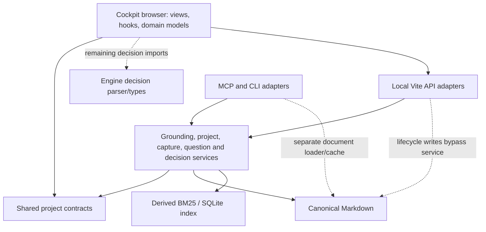

# Separation of concerns and optimization review

Implementation follow-up: findings A1–A9 have been addressed in the working tree.
The findings below preserve the pre-change review evidence. Verification results
for the implementation are recorded in `docs/separation-of-concerns.md` and the
implementation handoff; the development watcher optimization remains a future,
measurement-driven follow-up.

## 1. Scope

- Review date: 2026-09-07.
- Revision: `f6b76de` — `feat(architecture): separate shared contracts and update scopes`.
- Reviewed: shared project contracts, update scopes, engine application services,
  retrieval, MCP adapters, Cockpit browser code and local write adapters.
- Method: source and commit review, existing verification, and isolated synthetic
  reproductions. Private knowledge content was not used as review evidence.
- Deliverable: this report only; application source was not changed.

## 2. Executive assessment

**The separation is moving in the right direction, but independent updates and
runtime efficiency are not yet fully established.** The latest change is a
useful extraction of existing project semantics into a pure shared module. It
primarily improves ownership rather than request-path efficiency, and the update
manifest does not capture all dependencies.

Keep the monorepo and continue extracting boundaries incrementally. The highest
value work is to make updates match actual dependencies, ensure every writer
participates in the same concurrency protocol, move project filtering into
retrieval, and give document loading a single owner.

The existing suite passes, but isolated scenarios exposed two older correctness
problems: a board move can undo a completed task, and unrelated documents can
crowd valid project evidence out of an answer. Neither was introduced by the
latest contracts extraction.

## 3. Current architecture and strengths

The public Cockpit build is static and demo-only. The local Vite API adapters are
development-only and are excluded from that runtime. There is no Python backend,
remote database, queue, or worker required in the reviewed flows.

Strengths worth preserving:

- Markdown is authoritative; indexes and browser content can be regenerated.
- Project parsing and attention rules have one pure implementation in
  `packages/contracts/src/projects.ts`. Compatibility entry points reuse it.
- Application services pin workspace context and provide reusable boundaries
  for the different adapters. Several mutation services refresh only after a
  real change, preserving no-op and dry-run behavior.
- Browser views, domain transformations, hooks and API clients already have
  distinct homes. Heavy views, Markdown rendering and Mermaid load lazily.
- Existing tests cover workspace confinement, mutation conflicts, browser bundle
  boundaries, protocol schemas and content isolation.

## 4. Architecture findings

### A1. UI update scope omits actual engine dependencies — P2

**Latest change:** the dependency declaration is new; the remaining imports
predate it.

[gke.layers.json](../../gke.layers.json), lines 32–43, declares that `ui` needs
only `contracts`. However:

- [domain/decisions.ts](../../apps/cockpit/src/domain/decisions.ts), lines 1–9,
  imports the runtime parser and types from `tools/decisions`; three other
  production browser files import decision types from that directory.
- [vite.config.ts](../../apps/cockpit/vite.config.ts), lines 5–17, imports local
  adapters and engine workspace configuration. The adapters import engine
  application services directly.

A same-revision monorepo build works. A UI update can nevertheless depend on
engine changes that its plan neither includes nor checks for compatibility.
The plan describes copy ownership, not a complete runtime or build dependency
graph. The documentation's independent-update claim needs this qualification.

Extract pure decision semantics into contracts. Distinguish browser code from
local adapters and declare the adapters' compatible core requirement. Merely
adding all engine files to every UI copy would sacrifice the intended update
scope; a compatibility check can preserve narrow copies.

### A2. Contract verification couples a UI update to the new engine shims — P2

**Introduced in the latest change.**

[project-contract-test.ts](../../packages/contracts/project-contract-test.ts),
lines 67–69, compares function identity with engine compatibility exports. The
UI plan copies contracts and Cockpit but leaves those engine files unchanged.

Reproduction: load the preceding commit's engine implementation and the current
contract implementation using in-memory transpilation. Function identity is
different, while the fixture's parsed manifests match. Consequently, the
documented first UI-only update from the previous revision cannot pass its new
contract gate without also migrating the engine shims.

The same test also reads four specific Cockpit files at lines 85–93. Contracts
therefore cannot verify themselves without both consumers present.

Keep fixture-based contract tests self-contained. Move re-export identity checks
to engine integration tests and browser import checks to architecture tests.
Document the one-time migration if retaining the existing gate during transition.

### A3. Project filtering happens after the global result cutoff — P2

**Pre-existing correctness issue, reproduced on both retrieval backends.**

[grounding-application-service.ts](../../tools/grounding/grounding-application-service.ts),
lines 80–89, requests the global top 30 results and only then filters
`allowedPaths`. Cockpit supplies these paths for project-scoped questions in
[grounded-ask-plugin.ts](../../apps/cockpit/scripts/grounded-ask-plugin.ts),
lines 169–175.

| Synthetic corpus                                   | BM25 and SQLite result                     |
| -------------------------------------------------- | ------------------------------------------ |
| One allowed note containing the answer             | One evidence hit; answer does not abstain  |
| Same allowed note plus 40 stronger unrelated notes | Zero scoped evidence hits; answer abstains |

The relevant note is unchanged. Increasing a global result limit only moves the
failure threshold. Apply the allowed-path constraint before candidate truncation
inside both retrievers and include scope in query-cache identity. Preserve the
existing rule that no out-of-project evidence may be returned.

### A4. Board lifecycle writes bypass shared concurrency control — P1

**Pre-existing data-integrity issue, reproduced.**

[lifecycle-writeback-plugin.ts](../../apps/cockpit/scripts/lifecycle-writeback-plugin.ts),
lines 98–102, reads and rewrites the whole Markdown file directly. Task completion
uses a project lock in [project-service.ts](../../tools/projects/project-service.ts),
lines 452–521, but the lifecycle adapter does not participate in that lock.

An isolated reproduction paused the lifecycle operation after its read, completed
a task through the real task service, then resumed the lifecycle write:

- Task completion reported a change and persisted the checked task.
- The lifecycle request returned HTTP 200 and persisted the new lane.
- The final file contained the lane change but reverted the task to unchecked.

Move lifecycle changes behind an application service and give **all writers of
the same project file** a common lock or version-conflict protocol. Atomic rename
alone does not prevent stale read/modify/write operations; simply delegating to
the current `updateProject` is also insufficient because it lacks that shared
lock. Publish retrieval invalidation after a successful mutation.

### A5. Document loading and refresh have multiple owners — P2

**Pre-existing efficiency issue, measured as file I/O.**

MCP maintains a separate parsed-document cache in
[server.ts](../../tools/kb-mcp-server/server.ts), lines 1380–1431. Its refresh
path, lines 974–986, runs that loader alongside a forced grounding refresh. The
grounding rebuild reads the files again.

Instrumenting `fs.readFile` in an isolated three-note workspace showed that
`kb.refresh` read each note twice. Adding an open question read every existing
note twice again, plus the new question file twice. Both operations succeeded.

Use one workspace document snapshot for record lookup and retrieval indexing.
Centralize invalidation, then consider changed-path refresh if measurements
justify it. Retain workspace isolation, citation line accuracy, full rebuilds
and read-after-write guarantees. Debouncing already helps, but does not eliminate
the duplicate corpus passes.

### A6. Workspace review repeatedly reloads every project — P2

**Pre-existing scaling issue established from the call structure.**

[project-review.ts](../../tools/projects/project-review.ts), line 50, lists all
projects; lines 69–70 then call `getProject` for each one.
[getProject](../../tools/projects/project-service.ts), lines 257–268, discovers,
reads and parses every project manifest on each call to detect matching IDs.

For P project records, that is approximately P² + P manifest reads/parses before
the additional retrieval work. Build a single request-level map of parsed
projects, preserving duplicate-ID detection. The per-document Git work in
`project-review.ts`, lines 174–185, is another batching opportunity: it launches
up to three subprocess calls per document under an unbounded `Promise.all`.

### A7. Architecture checks validate declarations more than dependencies — P2

The layer validator checks path ownership, protected roots, existence and
declared dependency cycles. Those are useful controls, but it does not inspect
source imports. The contract test scans only four named browser files and only
rejects `tools/projects` imports. New files and imports from other engine modules
are not covered.

Add an import-graph check for all production browser files, contracts and core,
with explicit rules for local adapters. Keep pure contracts free of platform
imports and check actual cycles separately from manifest cycles. Test the scoped
upgrade against the previous supported revision; current-checkout tests alone
cannot establish compatibility between independently updated layers.

### A8. Shared parsing still leaves conflicting project rules — P2

**Pre-existing semantic drift, reproduced with synthetic records.**

[Cockpit projects.ts](../../apps/cockpit/src/domain/projects.ts), lines 99–107,
can derive `nextActions` from the current checklist while choosing
`recommendedNextAction` and `nextThreeActions` from stale prose. One fixture
produced `nextActions: ["Current action"]` and
`recommendedNextAction: "Stale action"`. The existing checklist test asserts
only the first field.

Membership also differs: the UI's `buildEligiblePaths`, lines 474–486, omits
untagged evidence inside a project's canonical folder unless linked or covered
by a source root. The engine's
[project-scope.ts](../../tools/projects/project-scope.ts), line 63, includes that
evidence by canonical folder membership. The UI can therefore display a
different project context from the engine for the same Markdown records.

Share the pure membership and next-action selection rules, or expose a canonical
project projection from core. Keep presentation labels, grouping and view state
in Cockpit. Add parity fixtures covering untagged canonical-folder evidence,
stale next-action prose and a checklist whose tasks are all complete.

### A9. Cockpit repeats derived work outside the active screen — P2 optimization

[App.tsx](../../apps/cockpit/src/App.tsx), lines 580–610, builds all project
summaries twice, even when `projectDocs` is the same array as `docs`. Graph
calculations at lines 683–693 run regardless of the active route. Memoization
avoids some subsequent work but does not avoid these initial calculations or
their recomputation when dependencies change.

A synthetic benchmark of one `buildProjectSummaries` call with 100 projects on
Node 24, after warmup and taking the median of three runs, measured:

| Documents | Time for one summary calculation |
| --------- | -------------------------------- |
| 1,000     | 8.7 ms                           |
| 5,000     | 47.5 ms                          |
| 10,000    | 148.1 ms                         |

These are pure-function measurements, not browser latency or real-workspace
performance. Reuse summaries when inputs are identical, build path/project
indexes once, and compute graph-specific state when that screen needs it.
Verify output parity and profile real navigation before claiming a UX speedup.

The development watcher is another later optimization: it polls every 1.5
seconds and resynchronizes the complete derived content tree after a change.
Incremental synchronization can follow if larger-workspace measurements show it
dominates edit-to-preview latency.

## 5. Security and integrity assessment

The latest extraction did not expose a new remotely exploitable vulnerability
in the reviewed paths. This was an architecture-focused review, not a complete
dependency or deployment security audit.

| Control                                              | Assessment and evidence                                                                                                                                         |
| ---------------------------------------------------- | --------------------------------------------------------------------------------------------------------------------------------------------------------------- |
| Local mutation authorization                         | Pass in sampled paths: shared loopback, host and same-origin checks in `apps/cockpit/scripts/local-dev-api.ts`; bounded JSON bodies and unknown-field rejection |
| Workspace write confinement                          | Pass in inspected paths and exercised tests, including read-only workspaces and symlink/path guards                                                             |
| Remote HTTP access                                   | Pass in exercised tests: API key required and read-only tool boundary enforced                                                                                  |
| Hosted/private separation                            | Public build and production-boundary gate passed with the sanitized demo corpus                                                                                 |
| Concurrent canonical writes                          | Fail: A4 reproduces a lost update between authorized operations; high integrity impact, not evidence of unauthorized access                                     |
| Password/MFA/session controls                        | Not applicable to the reviewed static/local architecture                                                                                                        |
| Full dependency, secret-history and deployment audit | Not assessed in this review                                                                                                                                     |

## 6. Implementation proposals

Effort is relative: small means a contained change; medium means coordinated
changes across consumers; large means a shared ownership change requiring broad
integration coverage. These are not delivery estimates.

| Proposal                                    | Priority | Impact / effort                                      | Steps and verification                                                                                                                                                                                |
| ------------------------------------------- | -------- | ---------------------------------------------------- | ----------------------------------------------------------------------------------------------------------------------------------------------------------------------------------------------------- |
| Unify project mutation concurrency (A4)     | P1       | Prevent lost user work / medium                      | Inventory every writer of a project file; share the read/modify/write lock or conflict token; move lifecycle persistence into a service; test the reproduced interleaving, no-op behavior and refresh |
| Correct scoped retrieval (A3)               | P2       | Preserve answer recall as the corpus grows / medium  | Add allowed-path filtering in both retrievers before top-K; include scope in cache keys; test more than 30 competing unrelated records and verify zero cross-project citations                        |
| Make update scopes truthful (A1, A2)        | P2       | Reliable independent updates / medium                | Extract decision contracts; declare adapter/core compatibility; separate unit and consumer contract tests; verify a UI-only upgrade from the preceding supported revision                             |
| Enforce dependency directions (A7)          | P2       | Prevent architectural regression / small–medium      | Check all production imports and cycles; seed forbidden edges in isolated test fixtures and require failures; keep platform adapters explicitly allowed                                               |
| Unify project meaning (A8)                  | P2       | Consistent project context and next actions / medium | Share pure membership and next-action rules; compare engine/UI outputs for canonical-folder evidence, stale prose and completed checklists                                                            |
| Reuse workspace document snapshots (A5)     | P2       | Reduce repeated corpus I/O and parsing / large       | Establish one loader and invalidation owner; adapt MCP lookup/index consumers; verify at most one document-read pass per full refresh and current answers after mutations                             |
| Load review inputs once (A6)                | P2       | Remove quadratic manifest work / medium              | Build one project map per review with duplicate checks; batch/bound Git calls; verify manifest read counts scale linearly and report contents remain identical                                        |
| Avoid unnecessary browser calculations (A9) | P2       | Lower CPU work on large catalogs / small–medium      | Reuse identical-input summaries and path indexes; defer graph derivation; preserve selector outputs and benchmark representative navigation                                                           |

## 7. Execution order and validation

First fix the reproduced lost update and scoped retrieval problem. Neither
requires reorganizing packages. Next make scope declarations and compatibility
tests reflect the real consumers, then enforce those directions in CI.

Optimize workspace review with a request-level record map before undertaking a
larger document-cache consolidation. Benchmark representative synthetic corpus
sizes for cold/warm search, project review and write-to-answer latency. Keep
latency and memory measurements separate from file-read counts and bundle size.

Avoid introducing separate repositories, independent publishing, a dependency
injection framework or new runtime infrastructure solely to make the diagram
look cleaner. Extract a public core package when an actual consumer needs it.

Checks run successfully on Node 22.17.0:

- Engine typecheck, lint, format check and build.
- Layer and contract tests; project service, grounding service, questions,
  capture, decisions, MCP catalog and HTTP bridge test scripts.
- Cockpit typecheck, lint, format check, all 34 test files / 194 tests, and build.
- Cockpit production-boundary and bundle-budget checks.
- Isolated reproductions for scoped retrieval, lifecycle/task interleaving,
  duplicate refresh reads, previous-engine/current-contract identity, and
  divergent project membership/next-action selection.

The additional synthetic summary-calculation benchmark in A9 used Node 24.

Lint completed with 34 engine warnings and 23 Cockpit warnings, and no errors.
The public build reported approximately 78.3 KB initial gzipped JavaScript and
16.2 KB initial gzipped CSS. These figures exclude dynamically loaded chunks and
describe the 20-document demo build, not large private workspaces or end-user
interaction latency.

The complete `test:gke` chain, package-install test, scrub/history scan and
production-scale timing benchmarks were not run. Passing the selected existing
checks does not cover the additional failure scenarios reproduced here.

## 8. Assumptions and remaining decisions

- Independent UI updates are a desired workflow, based on the new manifest and
  separation document. The supported core-version range still needs to be made
  explicit; a package version constant alone does not enforce it.
- Keep operational adapters close to their deployment while defining their
  dependencies accurately. A folder split is optional; an enforced boundary is
  what matters.
- Current workload sizes and acceptable cold/warm latency targets were not
  supplied. The review establishes concrete redundant work and correctness
  gaps, and includes a synthetic calculation benchmark, but does not claim a
  measured speedup from the proposed refactors.
