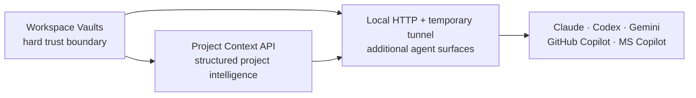

# Consultant Features — Implementation Roadmap

**Status:** In progress — MCP Core Modernization, Project Context, the Leakage
Guard, and the read-only loopback HTTP bridge are delivered. Tunnel and
Copilot-adapter work remain planned. **Repository:** Grounded
Knowledge Engine. **Last updated:** 2026-07-14. **Current execution:**
[Current Hardening and Operator Execution Plan](../planning/2026-07-14-current-hardening-and-operator-execution-plan.md).

## Product goal

Evolve GKE from a local grounded-memory engine into a trustworthy working
environment for consultants and technical users who move constantly between
clients, projects, agents, and Microsoft development environments.

The roadmap contains three connected features:

1. [Project Context](../../README.md#structured-project-context) — implemented
2. [Workspace Vaults and Leakage Guard](2026-06-21-workspace-vaults-leakage-guard.md) —
   thin local leakage guard implemented
3. [Remote MCP Gateway for Microsoft and GitHub Copilot](2026-06-21-remote-mcp-microsoft-copilot.md)

All three must implement the shared
[Workspace Data Architecture](../workspace-data-architecture.md). It is the
normative contract for paths, record schemas, IDs, relationships, runtime data,
workspace boundaries, and migration.

Decision Replay is tracked separately as remaining work because it is a new
product workflow, not one of the three consultant-foundation features:
[Decision Replay](2026-06-21-decision-replay.md).

Capture integrity and the local operator review loop are also tracked
separately. Their capture-planning and local-review foundations are
implemented, including source-aware re-ingestion and Cockpit daily attention.
Cockpit scaling remains planned. Together, they strengthen how grounded evidence becomes
canonical knowledge without expanding the four-tool core MCP surface:
[Capture Integrity and Operator Workflow Roadmap](../planning/2026-07-13-capture-integrity-and-operator-workflow-roadmap.md).

[MCP Core Modernization](2026-06-21-mcp-core-modernization.md) is delivered.
It established the small semantic tool catalog, profiles, typed outputs, safety
annotations, resources, and schema-budget gate that later features extend.

## Why these three belong together



- **Project Context API** makes the Cockpit’s existing project intelligence a
  reusable core-engine capability.
- **Workspace Vaults** ensures project context from one client cannot leak into
  another client or a personal workspace.
- **Local HTTP + temporary tunnel** safely exposes those capabilities from the
  user's machine to Copilot Studio and Microsoft 365 declarative agents while
  preserving the local `stdio` workflow and avoiding permanent deployment.

## Delivery order

### Phase 0 — MCP Core Modernization — delivered

Complete the shared MCP foundation before adding feature-specific tools.

Deliver:

- Core and full MCP profiles.
- Write-aware tool discovery.
- `kb.get_record` plus compatibility aliases.
- Formal output schemas and safety annotations.
- Generic record resources.
- Catalog-size CI budget.

Exit gate:

> The default MCP catalog remains intentionally small, every result is typed,
> and later features have a semantic extension pattern that does not require
> one low-level tool per file operation.

Status: passed by the MCP catalog, transport, and full GKE test suites.

### Phase 1 — Shared Project Context model — delivered

The shared Project Context model is implemented across the core, MCP server,
demo workspace, project CLI, and Operator Cockpit.

Deliver:

- Canonical `project_id` and project manifest schema.
- Shared deterministic project parser/model with legacy `module`,
  `lifecycle`, and `Next 3 actions` compatibility.
- `kb.resume_project`.
- Addressable `gke://project/<project-id>/context` resource.
- One deterministic technical-peer handoff.
- Cockpit refactor to consume the same model.
- Strict project-scoped retrieval and abstention tests.

Exit gate:

> The Cockpit and a fresh MCP session return the same cited project facts, and
> two projects with overlapping terminology never contaminate each other.

Status: passed by the project-context, MCP catalog/transport, Cockpit, and
full GKE test suites.

### Phase 2 — Workspace Vaults and Leakage Guard

Introduce the trust boundary before any tunnel exposure.

Deliver:

- Immutable workspace context at process startup.
- One MCP process/config entry per workspace.
- Canonical read and write root enforcement.
- Configured-root, symlink, and path-traversal protection before indexing and
  writing.
- Read-only defaults.
- Workspace identity in MCP responses and Cockpit chrome.
- Adversarial cross-workspace tests.

Exit gate:

> A Client Alpha process cannot retrieve, cite, or write any Client Beta or
> personal content, even through direct path or symlink attacks.

### Phase 3 — Local Microsoft Copilot tunnel proof and Copilot adapters

Add new agent surfaces only after the workspace policy is reusable.

Implementation note: the read-only loopback HTTP bridge is already
implemented and covered by integration tests. The authenticated tunnel and
Copilot adapters in this phase remain planned until the Leakage Guard is
complete.

Deliver:

- Shared MCP application layer.
- Existing local `stdio` transport retained.
- Loopback-only Streamable HTTP transport.
- Short-lived authenticated ngrok-compatible HTTPS tunnel.
- Strictly read-only tunnel profile with mutation tools unavailable.
- Dedicated sanitized demo workspace by default.
- Workspace-relative citations.
- GitHub Copilot local adapter.
- Copilot Studio setup guide.
- Microsoft 365 declarative-agent example.
- Transport-parity, authentication, write-denial, and tunnel-shutdown tests.

Exit gate:

> The same workspace-scoped project-resume result is available through local
> `stdio` and a short-lived authenticated tunnel to the local Streamable HTTP
> endpoint, without exposing host paths or advertising remote writes.

This phase is a controlled proof of concept, not permanent deployment.
Canonical files and engine execution remain local, but returned evidence
traverses Microsoft and the tunnel provider. Internal company content requires
explicit approval.

## Shared architectural rules

1. Follow the normative
   [Workspace Data Architecture](../workspace-data-architecture.md).
2. Markdown remains canonical.
3. BM25 and SQLite indexes remain disposable derived data.
4. Project membership is explicit; semantic similarity alone never establishes
   scope.
5. Workspace boundaries are enforced before retrieval and filesystem access.
6. Every mutation is explicit, write-gated, and supports dry-run where relevant.
7. Provider integrations are adapters; no Claude-, Microsoft-, or
   GitHub-specific grounding implementation is allowed.
8. Tunnel access is opt-in, authenticated, short-lived, workspace-scoped, and
   strictly read-only in the first milestone.
9. Existing Claude, Codex, and Gemini local workflows must remain compatible.

## Shared validation gate

Each phase must run, at minimum:

```bash
npm run typecheck
npm run test:gke
npm --prefix apps/cockpit run typecheck
npm --prefix apps/cockpit run test
npm --prefix apps/cockpit run build
npm run scrub
```

The tunnel phase additionally requires its HTTP integration, authentication,
write-denial, and shutdown tests. No phase may be committed with a failing
required check.

## Public demonstration sequence

The three features can be demonstrated as one coherent consultant story:

1. Open the **Client Alpha** vault.
2. Ask any agent to resume the implementation project.
3. Receive the same cited Project Context shown in the Cockpit.
4. Export a technical handoff.
5. Attempt to retrieve a similarly named Personal Project fact and show it being
   blocked.
6. Open a Microsoft Copilot agent and retrieve the same sanitized workspace
   context through a short-lived authenticated tunnel to the local MCP endpoint.

This presents a stronger product story than three unrelated feature demos:

> Resume any project, preserve the boundary, use the agent your environment
> requires.

## Accepted roadmap decisions — 2026-06-22

1. Project Context ships as a reduced compatibility-first milestone: one resume
   tool, one project-context resource, one technical-peer handoff, and strict
   abstention outside the requested project.
2. Workspace Vaults ships as a thin security kernel: immutable process identity,
   realpath-enforced scan/write roots, read-only policy, and adversarial
   isolation tests. Audit/compliance extras are deferred.
3. Microsoft 365 Copilot remains a priority because it is the user's real
   workplace surface and can be tested with colleagues.
4. Microsoft validation must not require permanent deployment. The first path
   is a local loopback HTTP server exposed temporarily through an authenticated
   tunnel such as ngrok.
5. The tunnel milestone is read-only and uses sanitized or explicitly approved
   data. It is not production architecture.
6. GitHub Copilot local `stdio` support ships independently as a small adapter.
7. Decision Replay follows this three-phase foundation unless Microsoft testing
   reveals a more urgent user requirement.
