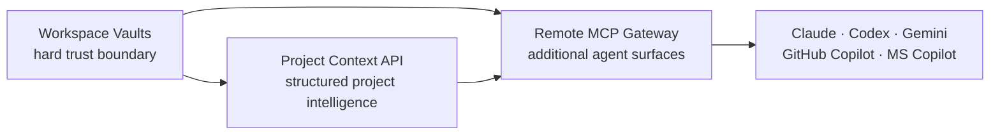

# Consultant Features — Implementation Roadmap

**Status:** Planned. **Repository:** Grounded Knowledge Engine.
**Last updated:** 2026-06-21.

## Product goal

Evolve GKE from a local grounded-memory engine into a trustworthy working
environment for consultants and technical users who move constantly between
clients, projects, agents, and Microsoft development environments.

The roadmap contains three connected features:

1. [Project Context API](2026-06-21-project-context-api.md)
2. [Workspace Vaults and Leakage Guard](2026-06-21-workspace-vaults-leakage-guard.md)
3. [Remote MCP Gateway for Microsoft and GitHub Copilot](2026-06-21-remote-mcp-microsoft-copilot.md)

All three must implement the shared
[Workspace Data Architecture](../workspace-data-architecture.md). It is the
normative contract for paths, record schemas, IDs, relationships, runtime data,
workspace boundaries, and migration.

Decision Replay is planned separately because it is a new product workflow,
not one of the three consultant-foundation features:
[Decision Replay](2026-06-21-decision-replay.md).

Before any of them, complete
[MCP Core Modernization](2026-06-21-mcp-core-modernization.md). It establishes
the small semantic tool catalog, profiles, typed outputs, safety annotations,
resources, and schema-budget gate that all later features must extend.

## Why these three belong together



- **Project Context API** makes the Cockpit’s existing project intelligence a
  reusable core-engine capability.
- **Workspace Vaults** ensures project context from one client cannot leak into
  another client or a personal workspace.
- **Remote MCP Gateway** safely exposes those capabilities to Copilot Studio
  and Microsoft 365 declarative agents while preserving the local `stdio`
  workflow.

## Delivery order

### Phase 0 — MCP Core Modernization

Complete the shared MCP foundation before adding feature-specific tools.

Deliver:

- Core and full MCP profiles.
- Write-aware tool discovery.
- `kb.get_record` plus compatibility aliases.
- Formal output schemas and safety annotations.
- Generic record resources.
- Catalog-size CI budget.

Exit gate:

> The default MCP catalog remains intentionally small, every result is typed,
> and later features have a semantic extension pattern that does not require
> one low-level tool per file operation.

### Phase 1 — Shared Project Context model

Implement the Project Context API first because much of the user experience
already exists in the Cockpit.

Deliver:

- Canonical `project_id` and project manifest schema.
- Shared deterministic project parser/model.
- `kb.get_project_context`.
- `kb.resume_project`.
- `kb.checkpoint_project`.
- `kb.create_handoff`.
- Cockpit refactor to consume the same model.
- Strict project-scoped retrieval tests.

Exit gate:

> The Cockpit and a fresh MCP session return the same cited project facts, and
> two projects with overlapping terminology never contaminate each other.

### Phase 2 — Workspace Vaults and Leakage Guard

Introduce the trust boundary before any remote deployment.

Deliver:

- Immutable workspace context at process startup.
- One MCP process/config entry per workspace.
- Read and write root enforcement.
- Symlink/path-traversal protection.
- Read-only defaults and sensitivity labels.
- Privacy-safe audit trail.
- Workspace identity in MCP responses and Cockpit chrome.
- Adversarial cross-workspace tests.

Exit gate:

> A Client Alpha process cannot retrieve, cite, or write any Client Beta or
> personal content, even through direct path or symlink attacks.

### Phase 3 — Remote MCP Gateway and Copilot adapters

Add new agent surfaces only after the workspace policy is reusable.

Deliver:

- Shared MCP application layer.
- Existing local `stdio` transport retained.
- Authenticated Streamable HTTP transport.
- Read-only remote defaults.
- Workspace-relative citations.
- GitHub Copilot local adapter.
- Copilot Studio setup guide.
- Microsoft 365 declarative-agent example.
- Transport-parity and authentication tests.

Exit gate:

> The same workspace-scoped `kb.get_project_context` result is available through
> local `stdio` and authenticated Streamable HTTP without exposing host paths or
> enabling unauthorized writes.

## Shared architectural rules

1. Follow the normative
   [Workspace Data Architecture](../workspace-data-architecture.md).
2. Markdown remains canonical.
3. BM25 and SQLite indexes remain disposable derived data.
4. Project membership is explicit; semantic similarity alone never establishes
   scope.
5. Workspace boundaries are enforced before retrieval and filesystem access.
6. Every mutation is explicit, write-gated, and supports dry-run where relevant.
7. Provider integrations are adapters; no Claude-, Microsoft-, or
   GitHub-specific grounding implementation is allowed.
8. Remote access is opt-in, authenticated, workspace-scoped, and read-only by
   default.
9. Existing Claude, Codex, and Gemini local workflows must remain compatible.

## Shared validation gate

Each phase must run, at minimum:

```bash
npm run typecheck
npm run test:gke
npm --prefix apps/cockpit run typecheck
npm --prefix apps/cockpit run test
npm --prefix apps/cockpit run build
npm run scrub
```

The Remote MCP phase additionally requires its HTTP integration and
authentication tests. No phase may be committed with a failing required check.

## Public demonstration sequence

The three features can be demonstrated as one coherent consultant story:

1. Open the **Client Alpha** vault.
2. Ask any agent to resume the implementation project.
3. Receive the same cited Project Context shown in the Cockpit.
4. Export a technical handoff.
5. Attempt to retrieve a similarly named Personal Project fact and show it being
   blocked.
6. Open a Microsoft Copilot agent and retrieve the same Client Alpha context
   through the authenticated remote MCP endpoint.

This presents a stronger product story than three unrelated feature demos:

> Resume any project, preserve the boundary, use the agent your environment
> requires.
