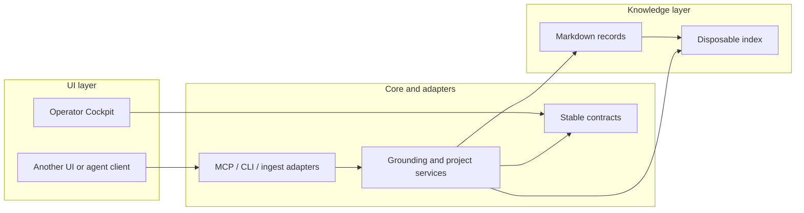

# UI, Knowledge Base, and Engine Boundaries

## Executive assessment

GKE already has good **logical separation** between its three product layers:

- the knowledge base is canonical Markdown;
- the engine owns indexing, retrieval, project rules, ingestion, and protocol
  adapters;
- the Operator Cockpit is an optional view over the same records.

The separation is not yet a complete **distribution boundary**. The engine and
Cockpit live in one repository and downstream installations commonly mirror
whole source trees. That makes a small UI upgrade feel like an engine upgrade
even when the knowledge base should remain untouched.

This change establishes `packages/contracts` as the versioned, browser-safe
record boundary shared by the UI and engine. It includes project and decision
records, project membership, checklist selection, and lifecycle transforms. The remaining direction is
incremental:

1. treat UI, engine, contracts, and KB as explicit update scopes;
2. add a previewable, scope-aware downstream sync command;
3. publish or independently build contracts/core only when another consumer
   requires that distribution model.

This keeps the current monorepo productive while creating a clean path to more
UIs and independently managed knowledge workspaces.

## The three layers



| Layer              | Current locations                                     | Owns                                                                                         | Must not own                                                    |
| ------------------ | ----------------------------------------------------- | -------------------------------------------------------------------------------------------- | --------------------------------------------------------------- |
| **UI**             | `apps/cockpit`                                        | routes, views, interaction state, browser effects, presentation-specific view models         | retrieval policy, canonical project meaning, private KB content |
| **Engine**         | `packages/contracts`, `tools/**`, `scripts/**`        | contracts, workspaces, parsing, retrieval, projects, decisions, capture, ingestion, adapters | customer-specific knowledge or UI presentation                  |
| **Knowledge base** | `demo-kb`, local `kb`, configured external scan roots | Markdown records, explicit project membership, source evidence                               | runtime code or derived indexes                                 |

The retrieval index and `apps/cockpit/content` are derived artifacts. They are
not a fourth source-of-truth layer and can be regenerated from Markdown.

## What is already well separated

### Knowledge bases are replaceable

The engine resolves a repository root and configured scan roots instead of
hard-coding one corpus. The MCP server can therefore run against another local
workspace through `KB_MCP_REPO_ROOT` and `KB_MCP_SCAN_ROOTS`. The Cockpit can
sync different source folders through `KB_PREVIEW_SOURCE_FOLDERS` during local
development.

The important invariant is already correct: Markdown remains authoritative,
while SQLite, in-memory indexes, and Cockpit content are rebuildable copies.

### UIs can use a provider-neutral boundary

An alternative UI does not need to import React code. It can use the MCP
surface for search, record retrieval, grounded answers, project resume, and
addressable `gke://` resources. The default catalog is deliberately small and
has formal input/output schemas and safety annotations.

For in-repository UI work, `packages/contracts` owns the versioned browser-safe
project parser, attention rules, and cross-surface types. The Cockpit imports
the named `@gke/contracts` boundary, while the former `tools/projects` entry
points remain compatibility re-exports for engine and downstream consumers. An import-graph gate checks every production browser file and contract module
for forbidden dependencies and runtime cycles. Contract fixture tests run without
either consumer present; compatibility-shim tests belong to the engine suite.

### The Cockpit has an internal UI architecture

The Cockpit already separates route views, reusable components, pure domain
transformations, browser hooks, and utilities. `App.tsx` is the coordinator,
not the owner of parsing or project rules. A visual change can normally remain
inside `apps/cockpit`.

### Write paths are bounded

- MCP writes are disabled by default and write tools are not advertised unless
  `KB_MCP_ENABLE_WRITES=true`.
- Write tools accept dry-run previews and are constrained to workspace paths.
- The loopback HTTP bridge forces the MCP server into read-only mode.
- The hosted Cockpit is a static, demo-only build. Local Vite write adapters
  remain absent from production and apply only after explicit UI actions and
  guarded previews where the operation supports them.

These runtime controls complement the repository-wide agent contract in
[`AGENTS.md`](../AGENTS.md).

## Agent contract assessment

GKE already had the correct home for a mandatory agent contract: `AGENTS.md`,
which is imported by the repository-specific Claude and Gemini guidance. A
second overlapping contract would create precedence drift, so this change keeps
one canonical document and strengthens it where the CoE-style checklist exposed
gaps.

| Required control         | Repository enforcement                                                                                       |
| ------------------------ | ------------------------------------------------------------------------------------------------------------ |
| Scope and permissions    | reversible work is limited to the request; unrelated and private KB files are preserved                      |
| Technology boundaries    | Node baseline, two npm trees, browser-safe contracts, and canonical Markdown are explicit                    |
| Security and data        | public-repo scrub, path confinement, write gating, and local-only boundaries fail closed                     |
| Working method and proof | surface-specific commands and truthful gate reporting are mandatory                                          |
| Stop conditions          | ambiguity, conflicting instructions, private-data risk, overwrites, and missing authority require escalation |
| Release authority        | publish, deploy, push, release, credentials, and external communication require explicit user approval       |

The contract governs agent behavior; it does not grant runtime authority. MCP
schemas, safety annotations, write discovery gates, workspace policy, dry-run
paths, and the read-only HTTP bridge remain the enforceable second line of
defense against involuntary actions.

## Where coupling remains

### 1. The contract is not independently distributed

`packages/contracts` now has its own package version and public project-record
entry point. It is still consumed as monorepo source, not built or published as
an independent artifact. A downstream UI must therefore sync a compatible
contract package along with a UI change that uses a new contract version.

### 2. The monorepo is also the distribution unit

Root engine and Cockpit npm trees are correctly separate, but releases do not
yet publish independently consumable packages. A downstream copy therefore
uses file synchronization as an update mechanism.

### 3. Downstream synchronization is broader than the architecture

A downstream workspace may keep its private KB and domain extensions separate,
yet a whole-tree sync still groups `tools/`, `apps/cockpit/`, demo content, and
root configuration into one operation. This is the main operational source of
friction. It is not evidence that the internal code architecture is poor.

### 4. The application-service API remains internal

Project record parsing and types now have an explicit package boundary.
Grounding, capture, and project application services still live under `tools/`
rather than a declared public core package. MCP remains the stable integration
contract for a truly separate UI.

## Change and verification matrix

Use the narrowest row that matches the change. Cross the boundary only when a
shared schema or parser changes.

| Change                                | Expected files                           | Required verification                                                 | KB impact                                                      |
| ------------------------------------- | ---------------------------------------- | --------------------------------------------------------------------- | -------------------------------------------------------------- |
| UI presentation or interaction        | `apps/cockpit/src`, Cockpit tests/styles | Cockpit typecheck, lint, tests, format check, build                   | none                                                           |
| Shared project rendering semantics    | `packages/contracts` plus adapters/tests | contract/project tests and Cockpit checks                             | records remain compatible unless the Markdown contract changes |
| Retrieval, capture, MCP, or ingestion | `tools/**`, root tests                   | root typecheck, lint, build, relevant engine tests                    | none unless a command explicitly writes                        |
| Markdown schema or canonical content  | `demo-kb` or a private workspace         | project validation, retrieval evaluation, Cockpit content/test checks | intentional                                                    |
| Agent permissions or release policy   | `AGENTS.md`                              | review contract and safety tests                                      | none                                                           |

Examples for a UI-only change:

```bash
cd apps/cockpit
npm run typecheck
npm run lint
npm run format:check
npm run test
npm run build
```

Do not run Cockpit `test` and `build` in parallel; both synchronize Markdown.

Examples for an engine-only change:

```bash
npm run typecheck
npm run lint
npm run build
npm run test:gke
```

## Machine-readable layer contract

[`gke.layers.json`](../gke.layers.json) declares the source roots, dependencies,
and verification commands for `contracts`, `core`, `ui`, and `demo`. The local
KB is a protected root and cannot be owned by a distributable layer.

The accompanying command is read-only:

```bash
npm run layers -- list
npm run layers -- show ui
npm run layers -- plan ui
npm run layers -- verify
```

`show ui` and the equivalent automation-oriented `plan ui` resolve transitive
dependencies, so their JSON contains both `packages/contracts` and
`apps/cockpit`, plus required exclusions and verification commands. A downstream
sync adapter can consume this plan rather than maintaining a second, drifting
definition of the source boundary. The `reconcile` list names shared root files
that require comparison but are not owned by the selected layer. `all` is a
virtual composite of every declared layer.

`dependsOn` names source scopes to copy together. `requires` names installed
prerequisites without adding their files to the copy. The UI requires `core`
because its local adapters call engine services and its build loads workspace
configuration. This distinction preserves narrow copy scopes without claiming
that the UI build is independent of core.

The installed core declares `cockpitApiVersion` in `tools/core-api.json`.
`npm --prefix apps/cockpit run check:core` checks that marker; Vite also checks it
at startup. API version 1 is the first declared compatibility baseline. A legacy
core without the marker, or a different API version, is rejected with an
instruction to update core. **The first upgrade to this boundary requires core
and UI together; later compatible UI updates can copy only UI and contracts.**
Run compatibility verification against the proposed source and installed core
before applying a downstream update. Scoped copying itself remains a downstream
responsibility.

Root manifests and TypeScript configuration are downstream integration seams;
the plan identifies them for deliberate reconciliation rather than automatic
overwrite by a layer copy.

## Safer downstream update process

Until the code is packaged independently, downstream installations should own
a small sync adapter and a versioned sync manifest. The source GKE repository
should never overwrite a downstream private KB.

Recommended scopes:

| Scope  | Files synchronized                                                                   | Compatibility check                              |
| ------ | ------------------------------------------------------------------------------------ | ------------------------------------------------ |
| `ui`   | `apps/cockpit/**` plus compatible `packages/contracts/**`; exclude generated folders | Cockpit checks plus shared project contract test |
| `core` | `tools/**`, `scripts/**`, `packages/contracts/**`; reconcile root configuration      | engine suite plus downstream domain tests        |
| `demo` | sanitized `demo-kb/**` only                                                          | scrub and demo tests                             |
| `all`  | `ui` + `core` + `demo`                                                               | full source and downstream verification          |

A proposed downstream command surface is:

```bash
# Preview drift without writing
npm run sync:gke -- --scope ui --check

# Apply only the reviewed UI scope, then run its verification chain
npm run sync:gke -- --scope ui

# Update the engine without copying the UI or any private KB
npm run sync:gke -- --scope core
```

The layer-inspection commands above are implemented. The scoped `sync:gke`
flags remain a **recommended downstream implementation**. That adapter should:

1. default to a non-writing check or provide an equally obvious preview;
2. reject an unknown scope;
3. exclude `content`, `dist`, `node_modules`, caches, local configuration, and
   every downstream-owned KB root;
4. record the upstream commit and exact synchronized roots;
5. warn on a dirty upstream checkout and local modifications inside the selected
   destination scope;
6. never delete outside the explicitly selected roots;
7. run scope-specific downstream tests after applying changes.

Because the UI consumes the contracts package, the `ui` scope must include its
compatible contract version and run `npm run test:contracts`. It does not need
to copy all of `tools/` when the installed core satisfies the declared API
requirement. Run `check:core` before selecting a UI-only update.

## Recommended target architecture

Do not split the repository into three repositories yet. First make the
contract explicit inside the monorepo:

```text
packages/contracts   record schemas and browser-safe parsing [implemented]
packages/core        grounding and project application services [planned]
adapters/mcp         MCP transport and catalog
adapters/cli         deterministic command surface
apps/cockpit         optional React UI
workspaces/*         external or local Markdown KBs, never bundled into core
```

The dependency direction should be one-way:

```text
UI / MCP / CLI adapters -> contracts + core -> workspace/file/index ports
KB content             -> no code dependency
core                    -> no React or browser dependency
```

`packages/contracts` is the first extracted boundary. It lets the UI and engine
share project meaning without the UI importing engine internals, while
`npm run test:contracts` checks self-contained record fixtures,
`npm run test:contracts:integration` checks engine re-exports, and
`npm run test:layers` checks production import directions and runtime cycles. Extract `packages/core` only when a second consumer needs a
direct TypeScript API; until then, MCP avoids premature package maintenance.

## Shared mutation and retrieval ownership

Project creation, metadata updates, source links, task additions/completions and
board lifecycle moves share the same per-project mutation lock. Lifecycle
persistence lives in the project application service; the local HTTP adapter
owns only request validation and response translation. Successful application
mutations invalidate in-process retrieval, while no-ops and dry runs do not.

Both retrieval backends filter allowed document paths before candidate limits
and ranking, and scope participates in query-cache identity. Document parsing
has one filesystem boundary. MCP record lookup reuses indexed documents;
refreshing both backends can reuse a single document snapshot. SQLite stores
full frontmatter and body data for parity with BM25. Derived index versions are
bumped automatically; Markdown records require no migration.

Workspace review parses project records once per request and batches tracking
and dirty-file metadata, with bounded concurrency for per-file Git history.
Cockpit reuses unchanged project summaries and avoids corpus-wide graph
calculations outside the graph screen. Shared membership and next-action rules
keep UI and engine interpretations aligned; checklist actions take precedence
over older next-action prose, including when no actionable checklist items
remain.

## Implementation verification (2026-09-07)

The separation-of-concerns follow-up passes the full engine suite and all 199
Cockpit tests across 35 test files. Both npm trees pass type checking, lint,
format checking and production builds; the Cockpit also passes its production
boundary and bundle-budget checks. Engine lint retains existing warnings.

Regression coverage includes retrieval scope before candidate limits on both
backends, concurrent project mutations, shared document read counts, isolated
contracts, import-boundary violations and UI/engine project semantics. These
checks validate behavior and the specific repeated-work reductions; they are
not an end-to-end latency benchmark or a manual browser acceptance run.

A second implementation review caught four gaps that the initial tests missed:
SQLite record reads did not expire after external Markdown edits; shared refresh
could honor caller scan roots instead of the pinned workspace; the import checker
missed TypeScript import-equals declarations; and lifecycle edits normalized CRLF
frontmatter. Each now has a regression that failed before its fix. Both backends
honor cache expiry, shared refresh uses workspace scan roots, import-equals edges
are checked, and lifecycle edits preserve existing line endings.

## Decision

GKE is sufficiently separated for one engine to serve different Markdown KBs
and multiple MCP-capable clients today. The project-record contract is now an
explicit versioned source package. The next valuable improvement is a safe,
scope-aware downstream sync process, not a large rewrite.

The architecture should be considered fully independently upgradable when:

- a UI-only sync cannot touch engine or KB files;
- an engine-only sync cannot touch UI or KB files;
- shared record/response compatibility is tested explicitly;
- every applied sync records its upstream version and passes the selected
  downstream verification chain;
- the agent and runtime write boundaries remain fail-closed.
