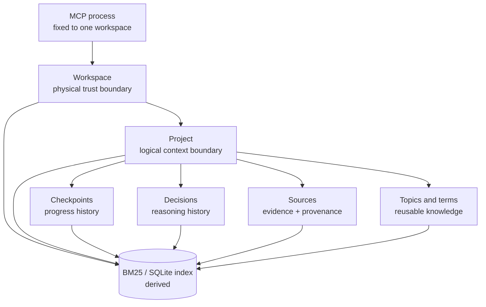
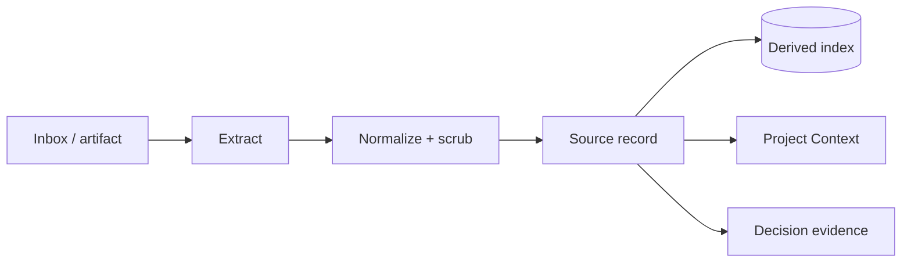

# Workspace Data Architecture

**Status:** Normative target architecture. **Last updated:** 2026-06-21.

This document is the shared data contract for:

- [MCP Core Modernization](prompt/2026-06-21-mcp-core-modernization.md)
- [Project Context API](prompt/2026-06-21-project-context-api.md)
- [Workspace Vaults and Leakage Guard](prompt/2026-06-21-workspace-vaults-leakage-guard.md)
- [Remote MCP Gateway](prompt/2026-06-21-remote-mcp-microsoft-copilot.md)
- [Decision Replay](prompt/2026-06-21-decision-replay.md)

When a feature plan and this document disagree about paths, identifiers,
ownership, or record relationships, this document wins unless it is explicitly
amended.

## Core model

> A workspace is a physical trust boundary.
>
> A project is a logical context boundary.
>
> A decision preserves reasoning.
>
> A checkpoint preserves progress.
>
> A source preserves evidence and provenance.



## Non-negotiable invariants

1. Markdown under `kb/` is canonical knowledge.
2. `.cache/` is derived, disposable, and rebuildable.
3. `.gke/` is private operational state, not knowledge.
4. One running MCP process is fixed to one workspace at startup.
5. The model cannot switch workspace by supplying a tool argument.
6. Project membership is explicit. Semantic similarity alone never establishes
   project scope.
7. Cross-workspace search is not supported.
8. Every write is authorized against both the active workspace and an allowed
   write root.
9. Historical checkpoints, decision evidence, and decision reviews are
   append-only.
10. Remote clients receive workspace-relative citations, never absolute host
    paths.
11. MCP tools express semantic intent; addressable knowledge is exposed through
    resources instead of multiplying low-level getter tools.
12. Every advertised MCP tool has a bounded schema, formal output contract, and
    safety annotations.

## MCP surface contract

The core architecture separates five concerns:

| Surface | Responsibility |
|---|---|
| Skill | When and why an agent should retrieve, capture, resume, or review |
| Prompt | User-triggered workflow template |
| Tool | Search, synthesis, or state-changing action |
| Resource | Addressable workspace knowledge |
| CLI/core | Deterministic implementation and automation |

Catalog rules:

1. `core` is the default profile.
2. `full` adds administration and compatibility aliases.
3. Primary mutation tools disappear from discovery when writes are disabled.
4. Compatibility aliases do not justify new aliases for future record types.
5. New features add semantic operations such as project context or decision
   review, not separate getters for every directory.
6. Catalog size and tool count are tested in CI.
7. MCP resources use `gke://` logical URIs and workspace-relative paths.

## Installation versus workspace data

The public Grounded Knowledge Engine repository contains:

- Engine source code.
- MCP transports and client adapters.
- Operator Cockpit source.
- A public demo workspace.
- Tests and fixtures.

A real consultant workspace contains the user's canonical knowledge and runtime
policy. It may be a separate repository or an untracked local directory.

Target layout:

```text
grounded-knowledge-engine/        # engine installation / public source
consultant-workspaces/
├── personal/
├── client-alpha/
└── client-beta/
```

Each workspace is independent:

```text
client-alpha/
├── kb/                           # canonical, portable Markdown
├── artifacts/                    # optional original files
├── inbox/                        # optional transient ingestion input
├── .cache/                       # disposable retrieval indexes
└── .gke/                         # local policy, audit, runtime state
```

The current public repository may continue to co-locate `demo-kb/` and `kb/`
for its runnable demonstration. That compatibility layout is not the
recommended structure for confidential multi-client use.

## Workspace boundary

A workspace represents one trust domain, such as:

- Personal projects.
- One client.
- One employer or internal organization.
- One deliberately shared public/demo corpus.

Do not represent separate confidential clients as:

```text
kb/client-alpha/
kb/client-beta/
kb/personal/
```

inside one broadly indexed MCP process. Tags and path prefixes are organization,
not a sufficient security boundary.

Use separate roots and processes:

```text
consultant-workspaces/
├── client-alpha/
│   ├── kb/
│   ├── .cache/
│   └── .gke/
└── client-beta/
    ├── kb/
    ├── .cache/
    └── .gke/
```

## Canonical workspace layout

```text
kb/
├── projects/
│   └── <project-id>/
│       ├── project.md
│       └── checkpoints/
│           └── <date>-<checkpoint-id>.md
├── decisions/
│   └── <decision-id>.md
├── sources/
│   └── <source-id>.md
├── topics/
│   └── <topic-slug>.md
├── terms/
│   └── <term-name>.md
└── open_questions.md
```

Not every workspace must contain every directory. Tools create a directory only
when its first record is written.

## Record identity

Every structured record uses:

- A stable, workspace-local identifier.
- A `record_type`.
- A `schema_version`.
- A human-readable title.
- An ISO `updated` date.

Identifiers:

| Record | Identifier | Example |
|---|---|---|
| Workspace | `workspace_id` | `client-alpha` |
| Project | `project_id` | `erp-cutover` |
| Checkpoint | `checkpoint_id` | `cp-20260621-handover` |
| Decision | `decision_id` | `pilot-location` |
| Source | `source_id` | `eurostat-regional-report-2026` |

Rules:

1. IDs use lowercase ASCII letters, numbers, and hyphens.
2. IDs do not change when a title changes.
3. IDs are unique within their workspace and record type.
4. A path may be derived from an ID, but code reads the stored ID as authority.
5. Cross-record links use IDs plus workspace-relative paths when useful.
6. IDs never encode confidential client names when the record may be exported.

## Shared frontmatter contract

Structured records use a conservative YAML subset that can be parsed
deterministically:

```yaml
---
schema_version: 1
record_type: project
workspace_id: personal
project_id: ai-tutor
title: AI Tutor Pilot
status: active
owner: dimo
updated: 2026-06-21
tags: ai, education, pilot
---
```

For the first implementation:

- Scalars are single-line strings.
- Lists may be represented as comma-separated strings until the shared parser
  supports YAML arrays consistently.
- Dates use `YYYY-MM-DD`.
- Unknown fields are preserved when rewriting a record.
- Required fields are validated by record type.

The current Cockpit frontmatter parser is intentionally simple. The Project
Context implementation must introduce one shared parser/normalizer rather than
adding a second incompatible frontend-only parser.

## Project record

Path:

```text
kb/projects/<project-id>/project.md
```

Minimum frontmatter:

```yaml
---
schema_version: 1
record_type: project
workspace_id: personal
project_id: ai-tutor
title: AI Tutor Pilot
status: active
owner: dimo
started_at: 2026-05-10
updated: 2026-06-21
review_after: 2026-07-05
tags: ai, education, pilot
source_roots: kb/sources/ai-tutor, kb/topics/ai-tutor
---
```

Required body sections:

```markdown
# AI Tutor Pilot

## Outcome

## Current focus

## Last meaningful change

## Active decisions

## Blockers

## Open questions

## Next actions

## Key documents
```

Rules:

1. `project.md` stores the current project state, not the complete event log.
2. `project_id` is the primary project key used by retrieval and MCP tools.
3. Project membership comes from one of:
   - Matching `project_id` frontmatter.
   - Residence under `kb/projects/<project-id>/`.
   - An explicit path listed by the project record.
4. `source_roots` narrows eligible project evidence. It does not override the
   workspace boundary.
5. A project query with no eligible evidence abstains; it never falls back to
   global workspace search.

## Checkpoint record

Path:

```text
kb/projects/<project-id>/checkpoints/<date>-<checkpoint-id>.md
```

Minimum frontmatter:

```yaml
---
schema_version: 1
record_type: checkpoint
workspace_id: personal
project_id: ai-tutor
checkpoint_id: cp-20260621-pilot-script
created_at: 2026-06-21
author: dimo
---
```

Required body sections:

```markdown
# Checkpoint — Pilot Script

## What changed

## Completed

## Current blocker

## Next starting point

## Evidence
```

Rules:

1. Checkpoints are append-only files.
2. Editing `project.md` does not rewrite old checkpoints.
3. Viewing or resuming a project does not create a checkpoint automatically.
4. Checkpoint evidence uses workspace-relative file-and-line citations.
5. Project Context uses recent checkpoints to calculate “last meaningful
   change” but continues to expose the canonical current state from
   `project.md`.

## Decision record

Path:

```text
kb/decisions/<decision-id>.md
```

Minimum frontmatter:

```yaml
---
schema_version: 1
record_type: decision
workspace_id: personal
decision_id: pilot-location
project_id: ai-tutor
title: Select the First Pilot Location
status: active
owner: dimo
decided_at: 2026-05-30
evidence_checked_at: 2026-05-30
review_after: 2026-06-20
confidence: medium
updated: 2026-05-30
tags: location, market-entry
---
```

Required body sections:

```markdown
# Select the First Pilot Location

## Decision question

## Recommendation

## Alternatives considered

## Rationale

## Assumptions

## Risks and caveats

## Evidence snapshot

## Review history

## Supersession
```

Rules:

1. The evidence snapshot records what supported the decision at decision time.
2. A review appends to `Review history`; it never replaces the old snapshot.
3. An overdue `review_after` makes the decision stale, not automatically wrong.
4. Superseding a decision preserves both records and links them in both
   directions.
5. `project_id` is optional only for truly workspace-wide decisions.

## Source record

Path:

```text
kb/sources/<source-id>.md
```

Source records are normalized, indexable representations of imported evidence.
Original binary files may remain under `artifacts/` or an external allowed
source root.

Minimum frontmatter:

```yaml
---
schema_version: 1
record_type: source
workspace_id: personal
source_id: eurostat-regional-report-2026
project_id: ai-tutor
title: Eurostat Regional Report 2026
source_kind: pdf
source_uri: artifacts/ai-tutor/eurostat-regional-report-2026.pdf
captured_at: 2026-05-30
source_date: 2026-04-15
content_hash: sha256:<digest>
updated: 2026-05-30
tags: economics, regional-data
---
```

Required body sections:

```markdown
# Eurostat Regional Report 2026

## Provenance

## Extracted content

## Ingestion warnings
```

Rules:

1. `source_uri` is workspace-relative or an approved external reference.
2. `content_hash` supports idempotent ingestion and changed-source detection.
3. Extracted Markdown is canonical for retrieval; the binary is supporting
   provenance.
4. A source can belong to one project, multiple explicitly listed projects, or
   the workspace generally.
5. Secrets and disallowed personal data are scrubbed before canonical capture.

The existing ingestion path writes topic notes. Migration to source records is
incremental: old topic outputs remain valid, while new ingestion gains explicit
`record_type`, `source_id`, and optional `project_id`.

## Topics and terms

Existing `kb/topics/` and `kb/terms/` remain supported.

- **Topics** hold reusable explanations, patterns, and how-to knowledge.
- **Terms** hold concise definitions and aliases.
- Add optional `workspace_id` and `project_id` when a note is scoped.
- A topic without `project_id` is workspace-wide, not globally shared across
  workspaces.

Do not move every existing topic into a project directory. Project Context may
link to shared workspace topics explicitly.

## Open questions

`kb/open_questions.md` remains the compatibility location for unresolved items.
New entries should carry an explicit project reference when project-scoped:

```markdown
- question: Which implementation partner will host the pilot?
  project_id: ai-tutor
  why it's open: Partner availability has not been confirmed.
  what would resolve it: Written confirmation from a candidate partner.
  status: open
  added: 2026-06-21
```

A later schema version may split open questions into individual records. That is
not required for the first consultant-feature milestone.

## Relationships and citations

Use explicit links and IDs:

```markdown
- Decision path: ../../decisions/pilot-location.md
- Source path: ../../sources/eurostat-regional-report-2026.md
```

Citation contract:

```json
{
  "workspaceId": "personal",
  "path": "kb/sources/eurostat-regional-report-2026.md",
  "line": 42,
  "recordType": "source",
  "recordId": "eurostat-regional-report-2026",
  "projectId": "ai-tutor"
}
```

Rules:

1. Local clients may receive the workspace-relative path and line.
2. Remote clients receive the same logical citation, never an absolute path.
3. Missing historical evidence is retained and marked missing.
4. Citation resolution never crosses the active workspace.

## Runtime and operational data

```text
.gke/
├── workspace.json
├── audit/
│   └── events.jsonl
└── runtime/

.cache/
├── retriever.sqlite
└── generated/
```

`.gke/workspace.json` target shape:

```json
{
  "schemaVersion": 1,
  "id": "client-alpha",
  "label": "Client Alpha",
  "repoRoot": ".",
  "scanRoots": ["kb"],
  "writeRoots": ["kb/projects", "kb/decisions", "kb/topics", "kb/terms", "kb/sources"],
  "readOnly": true,
  "sensitivity": "confidential",
  "auditLogPath": ".gke/audit/events.jsonl"
}
```

Rules:

1. `.gke/` and `.cache/` are gitignored by default.
2. Workspace configuration contains policy, not secrets.
3. Authentication secrets come from environment variables or a secret store.
4. Audit logs do not contain document bodies or full prompts by default.
5. If audit is mandatory for a restricted workspace and cannot be written,
   mutating operations fail.

## Ingestion lifecycle



1. Raw files enter through `inbox/`, an explicit path, or an agent attachment.
2. Extraction creates or updates a `source` record.
3. `content_hash` makes unchanged re-ingestion idempotent.
4. `project_id` associates the source with a project when supplied.
5. Index refresh occurs after successful canonical writes.
6. Source changes do not silently rewrite decision evidence snapshots.

## Retrieval lifecycle

Order of authorization and filtering:

```text
1. Resolve immutable workspace context.
2. Authorize scan roots and real paths.
3. Resolve requested project, if any.
4. Build the eligible path set.
5. Retrieve and rank only within that set.
6. Return workspace-relative citations.
```

Never retrieve globally and remove unwanted projects only after ranking. The
project and workspace boundaries must apply before evidence selection.

## Local and remote MCP mapping

Local:

```text
kb-personal      -> personal workspace -> stdio process
kb-client-alpha -> client-alpha workspace -> stdio process
```

Remote:

```text
https://gke.example.com/client-alpha/mcp
    -> authenticated client-alpha process
    -> client-alpha workspace only
```

The URL or process configuration chooses the workspace. A tool argument does
not.

## Migration from the current public repository

Migration must remain incremental:

1. Keep existing `demo-kb/topics/`, `kb/topics/`, and `kb/open_questions.md`
   readable.
2. Introduce the shared record parser and optional `record_type` metadata.
3. Add `kb/projects/<project-id>/project.md`.
4. Adapt the current demo project-board note into a project fixture without
   removing the original until compatibility tests pass.
5. Add project checkpoints.
6. Add decision and source records.
7. Introduce workspace configuration with a backward-compatible `default`
   workspace derived from current environment variables.
8. Move generated indexes under the active workspace `.cache/`.
9. Update ingestion to produce source records when project/provenance metadata
   is available.
10. Remove compatibility paths only in a later major schema version.

No bulk migration should occur without:

- A dry-run report.
- Backups or Git history.
- Record-count reconciliation.
- Retrieval regression tests.
- Cockpit rendering tests.

## Schema evolution

1. Every structured record carries `schema_version`.
2. Readers support the current and immediately previous schema version.
3. Writers emit only the current schema version.
4. Migrations are explicit commands, support dry-run, and do not run silently
   during ordinary search.
5. Unknown frontmatter fields and body sections are preserved.

## Validation requirements

Before the architecture is considered implemented, automated tests must prove:

1. The same project record produces equivalent Cockpit and MCP context.
2. Two projects with overlapping vocabulary remain isolated.
3. Two workspaces with identical paths and terms remain isolated.
4. Traversal and symlink escapes are blocked.
5. A read-only workspace cannot write.
6. Decision reviews preserve original evidence.
7. Checkpoints remain append-only.
8. Re-ingesting an unchanged source is idempotent.
9. Remote citations contain no host filesystem paths.
10. Existing topic/term KBs remain readable.

## Summary

The resulting model is intentionally simple:

| Concern | Owner |
|---|---|
| Client or personal trust boundary | Workspace |
| Current work and next actions | Project |
| Historical progress | Checkpoint |
| Recommendation and rationale | Decision |
| Imported evidence and provenance | Source |
| Reusable knowledge | Topic / term |
| Retrieval acceleration | `.cache/` |
| Policy and audit | `.gke/` |

This structure allows GKE to grow without losing its central promise: local
files remain understandable, portable, and under the user's control.
